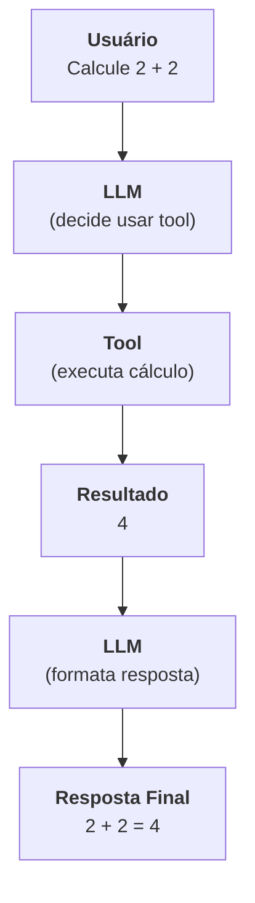
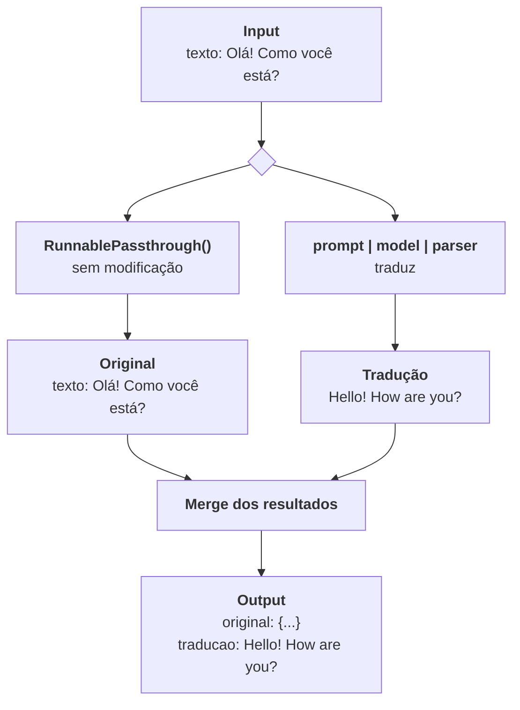
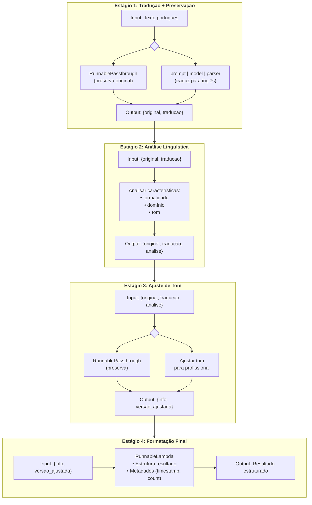
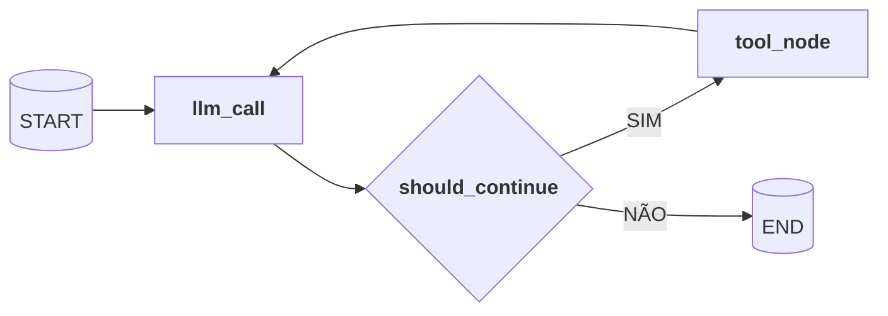
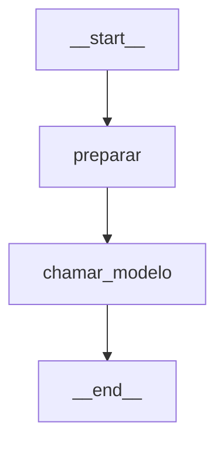
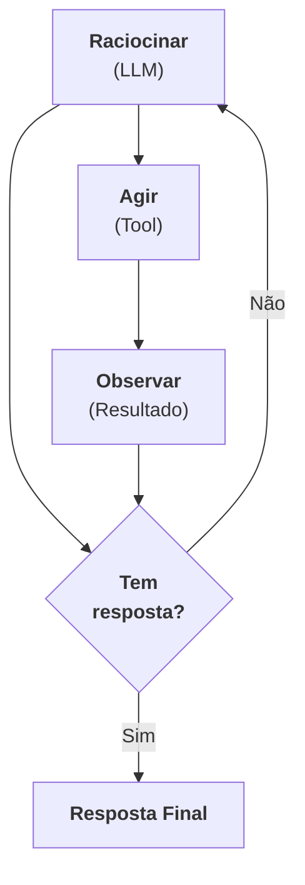
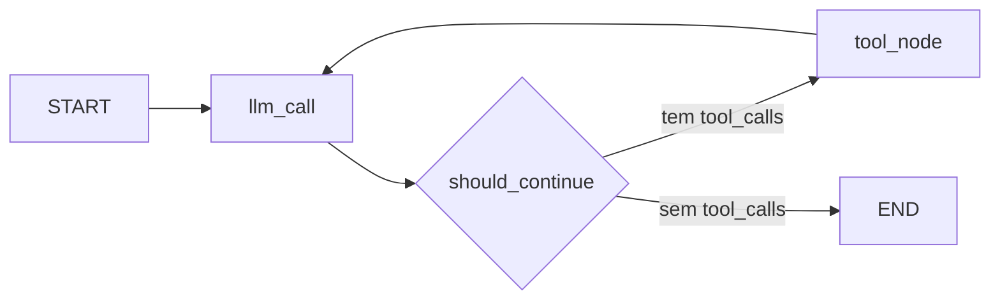

# Tutorial Completo de LangChain e LangGraph v1.0+

**Desenvolvimento de Agentes Inteligentes com Python**

---

## Sumário

### Parte I: Fundamentos
1. [Introdução ao Ecossistema LangChain](#capítulo-1-introdução-ao-ecossistema-langchain)
2. [Mensagens e Prompts](#capítulo-2-mensagens-e-prompts)
3. [Tools (Ferramentas)](#capítulo-3-tools-ferramentas)

### Parte II: LCEL e Composição Declarativa
4. [LangChain Expression Language (LCEL)](#capítulo-4-langchain-expression-language-lcel)
5. [Modularidade e Interoperabilidade](#capítulo-5-modularidade-e-interoperabilidade)

### Parte III: Introdução ao LangGraph
6. [Introdução ao LangGraph v1.0+](#capítulo-6-introdução-ao-langgraph-v10)
7. [Persistência e Memória (Checkpointing)](#capítulo-7-persistência-e-memória-checkpointing-v10)
8. [Streaming de Respostas](#capítulo-8-streaming-de-respostas)
9. [Human-in-the-Loop (HITL)](#capítulo-9-human-in-the-loop-hitl)
10. [Map-Reduce e Paralelização Dinâmica](#capítulo-10-map-reduce-e-paralelização-dinâmica)

### Parte IV: Padrões Avançados
11. [Middleware e Guardrails em Agentes](#capítulo-11-middleware-e-guardrails-em-agentes)
12. [Deep Agents - Os 4 Pilares da IA Agêntica Avançada](#capítulo-12-deep-agents---os-4-pilares-da-ia-agêntica-avançada)
13. [Observabilidade em Agentes com LangSmith](#capítulo-13-observabilidade-em-agentes-com-langsmith)

### Parte V: RAG - Retrieval Augmented Generation
14. [Fundamentos de RAG](#capítulo-14-fundamentos-de-rag)
15. [Processamento de PDFs](#capítulo-15-processamento-de-pdfs)
16. [RAG Agêntico](#capítulo-16-rag-agêntico)

### Parte VI: Estudo de Caso - TaskMaster CLI
17. [Arquitetura do Projeto](#capítulo-17-arquitetura-do-projeto-taskmaster-cli)
18. [Implementação do Agente](#capítulo-18-implementação-do-agente)
19. [Implementação do RAG](#capítulo-19-implementação-do-rag)
20. [Interface de Terminal com Rich](#capítulo-20-interface-de-terminal-com-rich)

---

# PARTE I: FUNDAMENTOS

---

## Capítulo 1: Introdução ao Ecossistema LangChain

### 1.1 O Que São LLMs e Por Que Precisamos de Frameworks?

**Large Language Models (LLMs)** são modelos de inteligência artificial treinados em vastas quantidades de texto para compreender e gerar linguagem natural. Exemplos incluem GPT-4, Claude, Llama e Gemini.

Embora as APIs desses modelos sejam poderosas, construir aplicações robustas diretamente sobre elas apresenta desafios:

- **Gerenciamento de conversas**: Manter histórico, contexto e estado
- **Integração com ferramentas**: Permitir que o modelo execute ações no mundo real
- **Tratamento de erros**: Lidar com falhas, timeouts e respostas inesperadas
- **Orquestração complexa**: Coordenar múltiplas chamadas e decisões

É aqui que frameworks como **LangChain** e **LangGraph** entram em cena.

### 1.2 LangChain vs LangGraph: Qual a Diferença?

| Aspecto | LangChain | LangGraph |
|---------|-----------|-----------|
| **Foco** | Componentes e primitivos | Orquestração e fluxo |
| **Abstração** | Mensagens, prompts, tools | Grafos de estado, nós, arestas |
| **Uso** | Blocos de construção | Coordenação de agentes |
| **Analogia** | "Peças de Lego" | "Manual de montagem" |

**LangChain v1.0+** fornece os componentes fundamentais:
- `ChatOpenAI`, `ChatAnthropic` - Interfaces para LLMs
- `SystemMessage`, `HumanMessage`, `AIMessage` - Tipos de mensagens
- `@tool` - Decorator para criar ferramentas
- Schemas Pydantic para validação

**LangGraph v1.0+** fornece a orquestração:
- `StateGraph` - Grafos de estado para fluxos complexos
- Checkpointers - Persistência e recuperação de estado
- Streaming - Respostas em tempo real
- Human-in-the-Loop - Intervenção humana

**Resumo**: Use LangChain para os **componentes** e LangGraph para **coordená-los**.

### 1.3 Configuração do Ambiente

#### Pré-requisitos
- Python 3.10 ou superior
- Uma chave de API da OpenAI (ou outro provedor)

#### Criando o Projeto

**Com uv (gerenciador de pacotes recomendado)**:
```bash
# Instalar uv (se ainda não tiver)
curl -LsSf https://astral.sh/uv/install.sh | sh
# ou no Windows:
powershell -ExecutionPolicy ByPass -c "irm https://astral.sh/uv/install.ps1 | iex"

# Criar projeto e instalar dependências
uv init meu_agente
cd meu_agente
uv add langchain langchain-openai langgraph langchain-anthropic langchain-google-genai python-dotenv
```

**Criar o arquivo requirements.txt**:
```bash
uv pip freeze > requirements.txt
```

**Alternativa com pip e venv**:
```bash
# Criar diretório do projeto
mkdir meu_agente
cd meu_agente

# Criar ambiente virtual
python -m venv venv
source venv/bin/activate  # Linux/Mac
# ou: venv\Scripts\activate  # Windows

# Instalar dependências com pip
pip install langchain>=1.0.0 langchain-openai>=0.3.0 langgraph>=1.0.0 python-dotenv
```

#### Configurando Variáveis de Ambiente

Crie um arquivo `.env` na raiz do projeto:

```env
# .env
# OpenAI
OPENAI_API_KEY=sua-chave-openai-aqui
OPENAI_MODEL=gpt-4o-mini

# Anthropic
ANTHROPIC_API_KEY=sua-chave-anthropic-aqui
ANTHROPIC_MODEL=claude-4-5-haiku

# Google
GOOGLE_API_KEY=sua-chave-google-aqui
GOOGLE_MODEL=gemini-2.5-flush-lite
```

> **Importante**: Nunca commite o arquivo `.env` no Git! Adicione-o ao `.gitignore`.

#### Estrutura de Diretórios do Projeto

Para organizar os exemplos de código de cada capítulo, crie a seguinte estrutura de pastas:

```bash
# Criar pasta src e subpastas para cada capítulo
mkdir -p src/{ch01,ch02,ch03,ch04,ch05,ch06,ch07,ch08,ch09,ch10,ch11,ch12,ch13,ch14,ch15,ch16,ch17,ch18,ch19,ch20}
```

A estrutura resultante será:
```
meu_agente/
├── .env
├── requirements.txt
├── .gitignore
├── pyproject.toml (gerado pelo uv)
├── uv.lock
└── src/
    ├── ch01/
    ├── ch02/
    ├── ch03/
    ├── ch04/
    ├── ch05/
    ├── ch06/
    ├── ch07/
    ├── ch08/
    ├── ch09/
    ├── ch10/
    ├── ch11/
    ├── ch12/
    ├── ch13/
    ├── ch14/
    ├── ch15/
    ├── ch16/
    ├── ch17/
    ├── ch18/
    ├── ch19/
    └── ch20/
```

Cada pasta `chXX` será usada para armazenar os exemplos de código referentes ao capítulo correspondente.

### 1.4 Primeira Chamada a um LLM

Vamos criar nosso primeiro programa que se comunica com um LLM.

```python
# /src/ch01/hello_llm.py
import os
from dotenv import load_dotenv
from langchain_openai import ChatOpenAI
from langchain_core.messages import HumanMessage

# Carregar variáveis de ambiente do arquivo .env
load_dotenv()

# Criar instância do modelo
modelo = ChatOpenAI(
    model=os.getenv("OPENAI_MODEL", "gpt-4o-mini"),
    temperature=0  # 0 = determinístico, 1 = criativo
)

# Criar uma mensagem do usuário
mensagem = HumanMessage(content="Olá! Qual é a capital do Brasil?")

# Invocar o modelo
resposta = modelo.invoke([mensagem])

# Exibir a resposta
print(f"Resposta do modelo: {resposta.content}")
```

**Executando**:
```bash
python hello_llm.py
# Saída: Resposta do modelo: A capital do Brasil é Brasília.
```

#### Alternativa: Usando Modelos da Anthropic (Claude)

Se você preferir usar Claude, instale o pacote `langchain-anthropic`:

```bash
pip install langchain-anthropic
```

Depois, você pode usar Claude da seguinte forma:

```python
# /src/ch01/hello_llm_anthropic.py
import os
from dotenv import load_dotenv
from langchain_anthropic import ChatAnthropic
from langchain_core.messages import HumanMessage

# Carregar variáveis de ambiente do arquivo .env
load_dotenv()

# Criar instância do modelo Claude
modelo = ChatAnthropic(
    model=os.getenv("ANTHROPIC_MODEL", "claude-4-5-haiku"),
    temperature=0  # 0 = determinístico, 1 = criativo
)

# Criar uma mensagem do usuário
mensagem = HumanMessage(content="Olá! Qual é a capital do Brasil?")

# Invocar o modelo
resposta = modelo.invoke([mensagem])

# Exibir a resposta
print(f"Resposta do modelo: {resposta.content}")
```

#### Alternativa: Usando Modelos do Google (Gemini)

Se você preferir usar Gemini, instale o pacote `langchain-google-genai`:

```bash
pip install langchain-google-genai
```

Depois, você pode usar Gemini da seguinte forma:

```python
# /src/ch01/hello_llm_google.py
import os
from dotenv import load_dotenv
from langchain_google_genai import ChatGoogleGenerativeAI
from langchain_core.messages import HumanMessage

# Carregar variáveis de ambiente do arquivo .env
load_dotenv()

# Criar instância do modelo Gemini
modelo = ChatGoogleGenerativeAI(
    model=os.getenv("GOOGLE_MODEL", "gemini-2.0-flash"),
    temperature=0  # 0 = determinístico, 1 = criativo
)

# Criar uma mensagem do usuário
mensagem = HumanMessage(content="Olá! Qual é a capital do Brasil?")

# Invocar o modelo
resposta = modelo.invoke([mensagem])

# Exibir a resposta
print(f"Resposta do modelo: {resposta.content}")
```

> **Dica**: O LangChain oferece uma interface uniforme para diferentes provedores. Uma vez que você compreender como usar um modelo (OpenAI, Anthropic ou Google), trocar entre eles é tão simples quanto mudar a importação e instanciar uma classe diferente!

### 1.5 Entendendo o Código

Vamos analisar cada parte:

#### 1. Importações
```python
from langchain_openai import ChatOpenAI          # Interface para OpenAI
from langchain_core.messages import HumanMessage # Tipo de mensagem
```

O pacote `langchain_openai` é separado do `langchain` principal. Isso segue o padrão modular do LangChain v1.0+, onde cada provedor tem seu próprio pacote.

#### 2. Criação do Modelo
```python
modelo = ChatOpenAI(
    model="gpt-4o-mini",  # Modelo a usar
    temperature=0          # Controle de aleatoriedade
)
```

Parâmetros importantes:
- `model`: Qual modelo usar (gpt-4o, gpt-4o-mini, gpt-3.5-turbo)
- `temperature`: 0.0 (determinístico) a 1.0 (criativo)
- `max_tokens`: Limite de tokens na resposta
- `timeout`: Tempo máximo de espera

#### 3. Mensagens
```python
mensagem = HumanMessage(content="Olá!")
resposta = modelo.invoke([mensagem])
```

O modelo recebe uma **lista de mensagens**. Isso é fundamental para manter conversas, como veremos no próximo capítulo.

### 1.6 Exemplo Completo: Assistente Simples

Vamos criar um assistente que responde perguntas em um loop:

```python
# /src/ch01/assistente_simples.py
import os
from dotenv import load_dotenv
from langchain_openai import ChatOpenAI
from langchain_core.messages import HumanMessage, SystemMessage

load_dotenv()

def criar_assistente():
    """Cria e retorna uma instância do modelo."""
    return ChatOpenAI(
        model=os.getenv("OPENAI_MODEL", "gpt-4o-mini"),
        temperature=0.7
    )

def conversar(modelo, pergunta: str) -> str:
    """Envia uma pergunta ao modelo e retorna a resposta."""
    mensagens = [
        SystemMessage(content="Você é um assistente prestativo que responde em português."),
        HumanMessage(content=pergunta)
    ]
    resposta = modelo.invoke(mensagens)
    return resposta.content

def main():
    print("=== Assistente Simples ===")
    print("Digite 'sair' para encerrar.\n")

    modelo = criar_assistente()

    while True:
        pergunta = input("Você: ").strip()

        if pergunta.lower() == 'sair':
            print("Até logo!")
            break

        if not pergunta:
            continue

        resposta = conversar(modelo, pergunta)
        print(f"Assistente: {resposta}\n")

if __name__ == "__main__":
    main()
```

**Executando**:
```bash
python assistente_simples.py
```

```
=== Assistente Simples ===
Digite 'sair' para encerrar.

Você: Qual é o maior planeta do sistema solar?
Assistente: O maior planeta do sistema solar é Júpiter.

Você: E qual é o menor?
Assistente: O menor planeta do sistema solar é Mercúrio.

Você: sair
Até logo!
```

> **Nota**: Este assistente ainda não tem memória - cada pergunta é independente. No próximo capítulo, aprenderemos como manter o contexto da conversa.

### 1.7 Resumo do Capítulo

Neste capítulo, você aprendeu:

- **LLMs** são modelos de linguagem que compreendem e geram texto
- **LangChain** fornece componentes (mensagens, modelos, tools)
- **LangGraph** fornece orquestração (grafos, estado, persistência)
- Como **configurar o ambiente** com Python e variáveis de ambiente
- Como fazer sua **primeira chamada** a um LLM
- A estrutura básica de **mensagens** (HumanMessage, SystemMessage)

### 1.8 Exercícios

1. **Modifique o assistente** para usar `temperature=0` e depois `temperature=1`. Observe as diferenças nas respostas.

2. **Crie um tradutor** que receba texto em português e traduza para inglês.

3. **Experimente diferentes modelos**: Troque `gpt-4o-mini` por `gpt-4o` e compare a qualidade das respostas.

---

## Capítulo 2: Mensagens e Prompts

### 2.1 Tipos de Mensagens no LangChain

No LangChain v1.0+, a comunicação com LLMs é baseada em **mensagens tipadas**. Cada tipo de mensagem tem um papel específico na conversa:

```python
from langchain_core.messages import (
    SystemMessage,   # Instruções do sistema
    HumanMessage,    # Mensagens do usuário
    AIMessage,       # Respostas do assistente
    ToolMessage,     # Resultados de ferramentas
)
```

#### SystemMessage - Definindo o Comportamento

A `SystemMessage` define **quem o assistente é** e **como ele deve se comportar**. É sempre a primeira mensagem da conversa.

```python
from langchain_core.messages import SystemMessage

system = SystemMessage(content="""
Você é um assistente especializado em programação Python.
Responda sempre em português brasileiro.
Seja conciso e forneça exemplos de código quando apropriado.
""")
```

#### HumanMessage - Entrada do Usuário

A `HumanMessage` representa as mensagens enviadas pelo usuário:

```python
from langchain_core.messages import HumanMessage

pergunta = HumanMessage(content="Como criar uma lista em Python?")
```

#### AIMessage - Resposta do Assistente

A `AIMessage` representa as respostas geradas pelo modelo. Você a recebe como retorno do `invoke()`:

```python
resposta = modelo.invoke([system, pergunta])
# resposta é uma AIMessage
print(type(resposta))  # <class 'langchain_core.messages.ai.AIMessage'>
print(resposta.content)  # "Para criar uma lista em Python..."
```

#### ToolMessage - Resultado de Ferramentas

A `ToolMessage` carrega o resultado da execução de uma ferramenta. Veremos isso em detalhes no Capítulo 3.

```python
from langchain_core.messages import ToolMessage

resultado = ToolMessage(
    content="A tarefa foi criada com sucesso.",
    tool_call_id="call_abc123"  # ID da chamada da ferramenta
)
```

### 2.2 Estrutura de uma Conversa

Uma conversa é uma **lista de mensagens** que cresce ao longo do tempo:

```python
# /src/ch02/conversa_estruturada.py
import os
from dotenv import load_dotenv
from langchain_openai import ChatOpenAI
from langchain_core.messages import SystemMessage, HumanMessage, AIMessage

load_dotenv()

modelo = ChatOpenAI(model=os.getenv("OPENAI_MODEL", "gpt-4o-mini"))

# Histórico da conversa
historico = [
    SystemMessage(content="Você é um professor de história. Responda em português."),
    HumanMessage(content="Quem descobriu o Brasil?"),
    AIMessage(content="O Brasil foi oficialmente descoberto por Pedro Álvares Cabral em 22 de abril de 1500."),
    HumanMessage(content="E em que cidade ele desembarcou?"),
]

# O modelo tem acesso a todo o histórico
resposta = modelo.invoke(historico)
print(resposta.content)
# Saída: Pedro Álvares Cabral desembarcou na região que hoje é Porto Seguro, na Bahia.
```

> **Importante**: O modelo não tem memória interna. Você precisa enviar **todo o histórico** a cada chamada para manter o contexto.

### 2.3 Chatbot com Memória Manual

Vamos criar um chatbot que mantém o histórico da conversa:

```python
# /src/ch02/chatbot_com_memoria.py
import os
from dotenv import load_dotenv
from langchain_openai import ChatOpenAI
from langchain_core.messages import SystemMessage, HumanMessage

load_dotenv()

class Chatbot:
    def __init__(self, instrucoes: str):
        self.modelo = ChatOpenAI(
            model=os.getenv("OPENAI_MODEL", "gpt-4o-mini"),
            temperature=0.7
        )
        self.historico = [SystemMessage(content=instrucoes)]

    def conversar(self, mensagem: str) -> str:
        # Adicionar mensagem do usuário ao histórico
        self.historico.append(HumanMessage(content=mensagem))

        # Obter resposta do modelo
        resposta = self.modelo.invoke(self.historico)

        # Adicionar resposta ao histórico
        self.historico.append(resposta)

        return resposta.content

    def limpar_historico(self):
        # Mantém apenas a SystemMessage
        self.historico = [self.historico[0]]

def main():
    bot = Chatbot(
        instrucoes="Você é um assistente amigável. Responda em português de forma concisa."
    )

    print("=== Chatbot com Memória ===")
    print("Comandos: 'sair' para encerrar, 'limpar' para reiniciar conversa\n")

    while True:
        entrada = input("Você: ").strip()

        if entrada.lower() == 'sair':
            print("Até logo!")
            break
        elif entrada.lower() == 'limpar':
            bot.limpar_historico()
            print("Histórico limpo!\n")
            continue
        elif not entrada:
            continue

        resposta = bot.conversar(entrada)
        print(f"Bot: {resposta}\n")

if __name__ == "__main__":
    main()
```

**Testando a memória**:
```
Você: Meu nome é João
Bot: Olá, João! Prazer em conhecê-lo. Como posso ajudá-lo hoje?

Você: Qual é o meu nome?
Bot: Seu nome é João, conforme você me disse agora há pouco.
```

### 2.4 Templates de Prompt Dinâmicos

Muitas vezes precisamos criar prompts com variáveis dinâmicas. O LangChain oferece templates para isso:

```python
# /src/ch02/prompt_dinamico.py
from datetime import datetime
from langchain_core.prompts import ChatPromptTemplate

# Template com variáveis
template = ChatPromptTemplate.from_messages([
    ("system", """Você é um assistente pessoal.
Data atual: {data_atual}
Nome do usuário: {nome_usuario}
Responda sempre de forma personalizada."""),
    ("human", "{pergunta}")
])

# Preencher as variáveis
mensagens = template.invoke({
    "data_atual": datetime.now().strftime("%d/%m/%Y"),
    "nome_usuario": "Maria",
    "pergunta": "Que dia é hoje?"
})

print(mensagens)
# Saída: lista de mensagens com as variáveis substituídas
```

### 2.5 Injeção de Contexto: Data e Hora Atual

Um padrão comum é injetar informações dinâmicas no system prompt. Veja como o projeto JarvisChat faz isso:

```python
# /src/ch02/prompt_com_data.py
import os
from datetime import datetime
from dotenv import load_dotenv
from langchain_openai import ChatOpenAI
from langchain_core.messages import SystemMessage, HumanMessage

load_dotenv()

def get_system_prompt() -> str:
    """
    Gera o system prompt com data/hora atual.
    IMPORTANTE: Chamar a cada invocação para garantir data atualizada.
    """
    agora = datetime.now()

    # Tradução dos dias da semana
    dias_semana = {
        'Monday': 'segunda-feira',
        'Tuesday': 'terça-feira',
        'Wednesday': 'quarta-feira',
        'Thursday': 'quinta-feira',
        'Friday': 'sexta-feira',
        'Saturday': 'sábado',
        'Sunday': 'domingo'
    }

    dia_semana = dias_semana.get(agora.strftime('%A'), agora.strftime('%A'))
    data_formatada = agora.strftime('%d/%m/%Y')
    hora_formatada = agora.strftime('%H:%M')

    return f"""Você é um assistente pessoal inteligente.

## Informações Temporais
- Data atual: {data_formatada} ({dia_semana})
- Hora atual: {hora_formatada}

## Instruções
- Responda sempre em português brasileiro
- Use as informações temporais quando relevante
- Seja cordial e prestativo
"""

def main():
    modelo = ChatOpenAI(model=os.getenv("OPENAI_MODEL", "gpt-4o-mini"))

    mensagens = [
        SystemMessage(content=get_system_prompt()),
        HumanMessage(content="Que dia é hoje? E que horas são?")
    ]

    resposta = modelo.invoke(mensagens)
    print(resposta.content)

if __name__ == "__main__":
    main()
```

**Saída exemplo**:
```
Hoje é 10/12/2025, uma terça-feira, e são aproximadamente 15:30.
```

### 2.6 Boas Práticas para System Prompts

Um bom system prompt deve ser:

1. **Claro e específico**: Defina exatamente o papel do assistente
2. **Estruturado**: Use seções e formatação
3. **Contextualizado**: Inclua informações relevantes (data, usuário, etc.)
4. **Com exemplos**: Mostre o formato esperado das respostas

**Exemplo de system prompt bem estruturado**:

```python
SYSTEM_PROMPT = """
# Papel
Você é um assistente de gerenciamento de tarefas.

# Capacidades
- Criar, listar, atualizar e excluir tarefas
- Organizar tarefas por categorias
- Definir datas de vencimento

# Regras
1. Sempre confirme ações destrutivas (exclusão)
2. Use formato de data brasileiro (DD/MM/AAAA)
3. Seja conciso nas respostas

# Formato de Resposta
- Para listagem: use bullets (-)
- Para confirmações: use ✓ ou ✗
- Para datas: sempre em português

# Contexto
Data atual: {data_atual}
Usuário: {nome_usuario}
"""
```

### 2.7 Exemplo Completo: Assistente com Contexto

```python
# /src/ch02/assistente_contextualizado.py
import os
from datetime import datetime
from dotenv import load_dotenv
from langchain_openai import ChatOpenAI
from langchain_core.messages import SystemMessage, HumanMessage

load_dotenv()

class AssistenteContextualizado:
    def __init__(self, nome_usuario: str):
        self.modelo = ChatOpenAI(
            model=os.getenv("OPENAI_MODEL", "gpt-4o-mini"),
            temperature=0.7
        )
        self.nome_usuario = nome_usuario
        self.historico = []

    def _get_system_prompt(self) -> str:
        agora = datetime.now()
        return f"""Você é um assistente pessoal chamado Jarvis.

## Contexto
- Usuário: {self.nome_usuario}
- Data: {agora.strftime('%d/%m/%Y')}
- Hora: {agora.strftime('%H:%M')}

## Personalidade
- Seja cordial e use o nome do usuário ocasionalmente
- Responda em português brasileiro
- Seja conciso, mas completo
"""

    def conversar(self, mensagem: str) -> str:
        # System prompt atualizado a cada chamada (data/hora atual)
        system = SystemMessage(content=self._get_system_prompt())

        # Montar mensagens: system + histórico + nova mensagem
        mensagens = [system] + self.historico + [HumanMessage(content=mensagem)]

        # Obter resposta
        resposta = self.modelo.invoke(mensagens)

        # Atualizar histórico (sem o system, que é recriado)
        self.historico.append(HumanMessage(content=mensagem))
        self.historico.append(resposta)

        return resposta.content

def main():
    nome = input("Qual é o seu nome? ").strip() or "Usuário"
    assistente = AssistenteContextualizado(nome_usuario=nome)

    print(f"\nOlá, {nome}! Sou o Jarvis, seu assistente pessoal.")
    print("Digite 'sair' para encerrar.\n")

    while True:
        entrada = input("Você: ").strip()
        if entrada.lower() == 'sair':
            print(f"Até logo, {nome}!")
            break
        if entrada:
            resposta = assistente.conversar(entrada)
            print(f"Jarvis: {resposta}\n")

if __name__ == "__main__":
    main()
```

### 2.8 Resumo do Capítulo

Neste capítulo, você aprendeu:

- Os **4 tipos de mensagens**: SystemMessage, HumanMessage, AIMessage, ToolMessage
- Como **estruturar conversas** com listas de mensagens
- A implementar **memória manual** mantendo o histórico
- A criar **templates dinâmicos** com variáveis
- Como **injetar contexto** (data, hora, usuário) no prompt
- **Boas práticas** para system prompts eficazes

### 2.9 Exercícios

1. **Crie um chatbot temático**: Um assistente especializado em receitas culinárias que pergunta sobre ingredientes disponíveis.

2. **Limite de contexto**: Modifique o chatbot para manter apenas as últimas 10 mensagens no histórico (evitando estourar o limite de tokens).

3. **Prompt multilíngue**: Crie um assistente que detecta o idioma da pergunta e responde no mesmo idioma.

---

## Padrões Reutilizáveis de Código LangGraph

Nesta seção, você aprenderá os **padrões fundamentais** de código LangGraph que serão usados repetidamente nos capítulos posteriores. Em vez de duplicar essas implementações, os capítulos posteriores farão **referência** a esses padrões canônicos.

### Padrão 1: Nó LLM (llm_call)

Esta função implementa um nó que:
1. Obtém as mensagens do estado
2. Garante que existe um SystemMessage (prompt do sistema)
3. Chama o modelo LLM com as ferramentas disponíveis
4. Retorna a resposta como AIMessage

```python
def llm_call(state: AgentState) -> dict:
    """Nó que chama o LLM.

    Parâmetros:
        state (AgentState): Estado atual com lista de mensagens

    Retorna:
        dict: Dicionário com chave 'messages' contendo a resposta do modelo
    """
    messages = state["messages"]

    # Adicionar system prompt se não existir
    if not messages or not isinstance(messages[0], SystemMessage):
        messages = [SystemMessage(content=SYSTEM_PROMPT)] + messages

    # Chamar modelo
    response = modelo_com_tools.invoke(messages)

    return {"messages": [response]}
```

**Importante:**
- `SYSTEM_PROMPT` deve ser definido como string com as instruções do agente
- `modelo_com_tools` deve ser uma instância de modelo LangChain com `.bind_tools()` já aplicado
- A variável `AgentState` deve ser um TypedDict com campo `messages: list`

---

### Padrão 2: Nó de Ferramentas (tool_node)

Esta função implementa um nó que:
1. Obtém a última mensagem (AIMessage com tool_calls)
2. Itera sobre cada chamada de ferramenta
3. Executa a ferramenta usando um mapa `TOOLS_BY_NAME`
4. Retorna ToolMessages com os resultados

```python
def tool_node(state: AgentState) -> dict:
    """Nó que executa as tools chamadas pelo LLM.

    Parâmetros:
        state (AgentState): Estado atual com histórico de mensagens

    Retorna:
        dict: Dicionário com chave 'messages' contendo ToolMessages
    """
    messages = state["messages"]
    last_message = messages[-1]

    # Processar cada tool_call
    tool_messages = []
    for tool_call in last_message.tool_calls:
        tool_name = tool_call["name"]
        tool_args = tool_call["args"]
        tool_call_id = tool_call["id"]

        # Executar a tool
        try:
            tool_fn = TOOLS_BY_NAME[tool_name]
            result = tool_fn.invoke(tool_args)
        except Exception as e:
            result = f"Erro ao executar {tool_name}: {e}"

        # Criar ToolMessage com o resultado
        tool_messages.append(ToolMessage(
            content=str(result),
            tool_call_id=tool_call_id
        ))

    return {"messages": tool_messages}
```

**Importante:**
- `TOOLS_BY_NAME` deve ser um dicionário: `{"nome_tool": Tool, ...}`
- As Tools devem ser instâncias de `langchain.tools.Tool` ou decoradas com `@tool`
- O mapa `tool_call_id` conecta a resposta à solicitação original

---

### Padrão 3: Função de Decisão (should_continue)

Esta função implementa uma **função condicional** que:
1. Obtém a última mensagem do estado
2. Verifica se contém chamadas de ferramentas (tool_calls)
3. Roteia para `tool_node` se houver tools, ou finaliza (`__end__`) se não houver

```python
def should_continue(state: AgentState) -> Literal["tool_node", "__end__"]:
    """Função condicional que decide se deve executar tools ou finalizar.

    Parâmetros:
        state (AgentState): Estado atual com histórico de mensagens

    Retorna:
        Literal["tool_node", "__end__"]: Nome do próximo nó ou sinal de fim
    """
    messages = state["messages"]
    last_message = messages[-1]

    # Se a última mensagem tem tool_calls, executar tools
    if hasattr(last_message, "tool_calls") and last_message.tool_calls:
        return "tool_node"

    # Caso contrário, finalizar
    return "__end__"
```

**Importante:**
- Esta função retorna uma string que corresponde ao nome de um nó no grafo
- `"__end__"` é a constante especial do LangGraph para indicar fim da execução
- Use `Literal` do módulo `typing` para type hints

---

### Como Usar Estes Padrões

Nos capítulos subsequentes, quando você vir uma seção que implementa um agente LangGraph, ela frequentemente usará estes padrões. Para usá-los:

1. **Defina seu AgentState** com os campos necessários (miniscamente, `messages`)
2. **Adapte SYSTEM_PROMPT e TOOLS_BY_NAME** para seu caso de uso específico
3. **Copie as três funções** (llm_call, tool_node, should_continue)
4. **Construa seu grafo** usando o padrão de adicionar nós e arestas

Exemplo mínimo:
```python
from langgraph.graph import StateGraph, START, END

# 1. Definir estado
class MyAgentState(TypedDict):
    messages: list

# 2. Configurar modelo e ferramentas
SYSTEM_PROMPT = "Você é um assistente útil..."
modelo_com_tools = model.bind_tools(tools_list)
TOOLS_BY_NAME = {t.name: t for t in tools_list}

# 3. Copiar as três funções de padrão (llm_call, tool_node, should_continue)

# 4. Construir grafo
graph = StateGraph(MyAgentState)
graph.add_node("llm_call", llm_call)
graph.add_node("tool_node", tool_node)
graph.add_edge(START, "llm_call")
graph.add_conditional_edges("llm_call", should_continue, {
    "tool_node": "tool_node",
    "__end__": END
})
graph.add_edge("tool_node", "llm_call")
app = graph.compile()
```

---

## Capítulo 3: Tools (Ferramentas)

### 3.1 O Que São Tools e Por Que São Importantes?

**Tools** (ferramentas) são funções que o modelo pode **decidir chamar** para realizar ações no mundo real. Sem tools, o modelo é apenas um gerador de texto. Com tools, ele se torna um **agente** capaz de:

- Buscar informações em bancos de dados
- Fazer cálculos matemáticos
- Criar, atualizar e excluir dados
- Interagir com APIs externas
- Executar código

#### Fluxo de Execução com Tools



### 3.2 Criando Tools com o Decorator @tool

O LangChain v1.0+ usa o decorator `@tool` para criar ferramentas:

```python
# /src/ch03/tool_simples.py
from langchain.tools import tool

@tool
def somar(a: int, b: int) -> int:
    """Soma dois números inteiros.
    Args:
        a: Primeiro número
        b: Segundo número
    Returns:
        A soma dos dois números
    """
    return a + b


if __name__ == "__main__":
    # Inspecionar a tool
    print(f"Nome: {somar.name}")
    print(f"Descrição: {somar.description}")
    print(f"Schema: {somar.args}")

    # Exemplo de uso direto
    resultado = somar.invoke({"a": 5, "b": 3})
    print(f"Resultado: {resultado}")
```

**Saída**:
```
Nome: somar
Descrição: Soma dois números inteiros.
    Args:
        a: Primeiro número
        b: Segundo número
    Returns:
        A soma dos dois números
Schema: {'a': {'title': 'A', 'type': 'integer'}, 'b': {'title': 'B', 'type': 'integer'}}
Resultado: 8
```

> **Importante**: A **docstring** é fundamental! O LLM usa a descrição para decidir quando usar a tool.

### 3.3 Tools com Schemas Pydantic

Para tools mais complexas, use modelos Pydantic para validação:

```python
# /src/ch03/tool_com_pydantic.py
from langchain.tools import tool
from pydantic import BaseModel, Field
from typing import Optional
from datetime import date

class CriarTarefaInput(BaseModel):
    """Schema para criação de tarefas."""

    titulo: str = Field(description="Título da tarefa")
    descricao: Optional[str] = Field(default=None, description="Descrição detalhada")
    data_vencimento: Optional[date] = Field(
        default=None, description="Data de vencimento (YYYY-MM-DD)"
    )

@tool(args_schema=CriarTarefaInput)
def criar_tarefa(
    titulo: str,
    descricao: Optional[str] = None,
    data_vencimento: Optional[date] = None,
) -> str:
    """Cria uma nova tarefa no sistema.
    Use esta ferramenta quando o usuário quiser adicionar uma nova tarefa,
    atividade ou lembrete.
    """
    # Simulação - em produção, salvaria no banco de dados
    tarefa_id = 123
    resultado = f"Tarefa criada com sucesso!\n"
    resultado += f"- ID: {tarefa_id}\n"
    resultado += f"- Título: {titulo}\n"
    if descricao:
        resultado += f"- Descrição: {descricao}\n"
    if data_vencimento:
        resultado += f"- Vencimento: {data_vencimento.strftime('%d/%m/%Y')}\n"
    return resultado

if __name__ == "__main__":
    # Testar a tool diretamente
    print(
        criar_tarefa.invoke(
            {
                "titulo": "Estudar LangChain",
                "descricao": "Completar tutorial",
                "data_vencimento": "2025-12-15",
            }
        )
    )

    # Exemplo adicional: inspeção da tool
    print(f"\n--- Informações da Tool ---")
    print(f"Nome: {criar_tarefa.name}")
    print(f"Descrição: {criar_tarefa.description}")
    print(f"Schema: {criar_tarefa.args}")
```

### 3.4 Binding Tools ao Modelo

Para que o modelo possa usar as tools, precisamos "bindá-las":

```python
# /src/ch03/binding_tools.py
import os
from dotenv import load_dotenv
from langchain_core.tools import tool
from langchain_core.messages import HumanMessage

load_dotenv()

# Definir tools
@tool
def calcular(expressao: str) -> str:
    """Calcula uma expressão matemática simples.

    Args:
        expressao: Expressão matemática (ex: "2 + 2", "10 * 5")
    """
    try:
        # ATENÇÃO: eval() é perigoso em produção!
        # Use uma biblioteca segura como numexpr
        resultado = eval(expressao)
        return f"Resultado: {resultado}"
    except Exception as e:
        return f"Erro no cálculo: {e}"

@tool
def obter_clima(cidade: str) -> str:
    """Obtém informações sobre o clima de uma cidade.

    Args:
        cidade: Nome da cidade
    """
    # Simulação - em produção, chamaria uma API real
    climas = {
        "são paulo": "Nublado, 22°C",
        "rio de janeiro": "Ensolarado, 32°C",
        "curitiba": "Chuvoso, 15°C",
    }
    return climas.get(cidade.lower(), f"Clima não disponível para {cidade}")

if __name__ == "__main__":
    # Criar modelo COM tools bindadas
    from langchain_openai import ChatOpenAI
    modelo = ChatOpenAI(model=os.getenv("OPENAI_MODEL", "gpt-4o-mini"))
    modelo_com_tools = modelo.bind_tools([calcular, obter_clima])

    # Testar - o modelo decide qual tool usar
    resposta = modelo_com_tools.invoke([
        HumanMessage(content="Quanto é 15 vezes 8?")
    ])

    print(f"Conteúdo: {resposta.content}")
    print(f"Tool calls: {resposta.tool_calls}")
```

**Saída**:
```
Conteúdo:
Tool calls: [{'name': 'calcular', 'args': {'expressao': '15 * 8'}, 'id': 'call_abc123', 'type': 'tool_call'}]
```

> **Observe**: Quando o modelo decide usar uma tool, o `content` fica vazio e os argumentos vão em `tool_calls`.

### 3.5 Executando Tools e Retornando Resultados

O fluxo completo envolve:
1. Enviar mensagem ao modelo
2. Verificar se há tool_calls
3. Executar as tools
4. Enviar resultados de volta ao modelo
5. Obter resposta final

```python
# /src/ch03/executar_tools.py
import os
from dotenv import load_dotenv
from langchain_openai import ChatOpenAI
from langchain_core.tools import tool
from langchain_core.messages import HumanMessage, ToolMessage, AIMessage, BaseMessage

load_dotenv()

@tool
def calcular(expressao: str) -> str:
    """Calcula uma expressão matemática."""
    try:
        resultado = eval(expressao)
        return str(resultado)
    except Exception as e:
        return f"Erro: {e}"

@tool
def obter_clima(cidade: str) -> str:
    """Obtém o clima de uma cidade."""
    climas = {"são paulo": "22°C, Nublado", "rio de janeiro": "32°C, Sol"}
    return climas.get(cidade.lower(), "Dados não disponíveis")

# Mapear tools por nome
tools = [calcular, obter_clima]
tools_por_nome = {t.name: t for t in tools}

# Modelo com tools
modelo = ChatOpenAI(model=os.getenv("OPENAI_MODEL", "gpt-4o-mini"))
modelo_com_tools = modelo.bind_tools(tools)

def processar_com_tools(mensagem: str) -> str:
    """Processa uma mensagem, executando tools se necessário."""
    mensagens: list[BaseMessage] = [HumanMessage(content=mensagem)]

    # Primeira chamada ao modelo
    resposta = modelo_com_tools.invoke(mensagens)
    mensagens.append(resposta)

    # Se houver tool_calls, executar
    while resposta.tool_calls:
        for tool_call in resposta.tool_calls:
            nome_tool = tool_call["name"]
            args = tool_call["args"]
            tool_call_id = tool_call["id"]
            print(f"Executando tool: {nome_tool}({args})")
            # Executar a tool
            tool_fn = tools_por_nome[nome_tool]
            resultado = tool_fn.invoke(args)
            # Adicionar resultado como ToolMessage
            mensagens.append(ToolMessage(content=resultado, tool_call_id=tool_call_id))

        # Nova chamada ao modelo com os resultados
        resposta = modelo_com_tools.invoke(mensagens)
        mensagens.append(resposta)
    return resposta.text

# Testar
print(processar_com_tools("Quanto é 25 ao quadrado?"))
print("\n---\n")
print(processar_com_tools("Como está o clima em São Paulo?"))
```

**Saída**:
```
Executando tool: calcular({'expressao': '25ˆ2'})
25 ao quadrado é igual a 625.

---

Executando tool: obter_clima({'cidade': 'São Paulo'})
O clima em São Paulo está em torno de 22°C, com céu nublado.
```

### 3.6 Tool com Múltiplos Parâmetros

Vamos criar uma tool mais complexa para gerenciar tarefas:

```python
# /src/ch03/tool_tarefas.py
from langchain_core.tools import tool
from pydantic import BaseModel, Field
from typing import Optional, Literal
from datetime import date
from enum import Enum

class EstadoTarefa(str, Enum):
    PENDENTE = "pendente"
    CONCLUIDA = "concluida"
    ARQUIVADA = "arquivada"

class ListarTarefasInput(BaseModel):
    """Schema para listagem de tarefas."""
    estado: Optional[Literal["pendente", "concluida", "arquivada"]] = Field(
        default=None,
        description="Filtrar por estado da tarefa"
    )
    categoria: Optional[str] = Field(
        default=None,
        description="Filtrar por categoria"
    )

# Banco de dados simulado
TAREFAS_DB = [
    {"id": 1, "titulo": "Estudar Python", "estado": "pendente", "categoria": "Estudos"},
    {"id": 2, "titulo": "Fazer compras", "estado": "concluida", "categoria": "Pessoal"},
    {"id": 3, "titulo": "Reunião de equipe", "estado": "pendente", "categoria": "Trabalho"},
]

@tool(args_schema=ListarTarefasInput)
def listar_tarefas(
    estado: Optional[str] = None,
    categoria: Optional[str] = None
) -> str:
    """Lista as tarefas do usuário com filtros opcionais.

    Use esta ferramenta para mostrar tarefas existentes.
    Pode filtrar por estado (pendente, concluida, arquivada) e/ou categoria.
    """
    tarefas = TAREFAS_DB.copy()

    # Aplicar filtros
    if estado:
        tarefas = [t for t in tarefas if t["estado"] == estado]
    if categoria:
        tarefas = [t for t in tarefas if t["categoria"].lower() == categoria.lower()]

    if not tarefas:
        return "Nenhuma tarefa encontrada com os filtros especificados."

    # Formatar resultado
    resultado = f"Encontradas {len(tarefas)} tarefa(s):\n\n"
    for t in tarefas:
        emoji = "⏳" if t["estado"] == "pendente" else "✅" if t["estado"] == "concluida" else "📦"
        resultado += f"{emoji} [{t['id']}] {t['titulo']}\n"
        resultado += f"   Categoria: {t['categoria']} | Estado: {t['estado']}\n\n"

    return resultado

# Testar
print(listar_tarefas.invoke({"estado": "pendente"}))
```

### 3.7 Boas Práticas para Tools

1. **Docstrings descritivas**: O LLM usa a descrição para decidir quando usar a tool
2. **Nomes claros**: Use verbos no infinitivo (criar, listar, atualizar, excluir)
3. **Validação com Pydantic**: Garante que os argumentos estão corretos
4. **Tratamento de erros**: Retorne mensagens de erro úteis, não exceções
5. **Retorno informativo**: Confirme o que foi feito, não apenas "sucesso"

```python
# Exemplo de tool bem documentada
@tool
def criar_tarefa(titulo: str, data_vencimento: Optional[str] = None) -> str:
    """Cria uma nova tarefa no sistema de gerenciamento.

    Use esta ferramenta quando o usuário quiser:
    - Adicionar uma nova tarefa
    - Criar um lembrete
    - Agendar uma atividade

    Args:
        titulo: Título descritivo da tarefa (obrigatório)
        data_vencimento: Data limite no formato YYYY-MM-DD (opcional)

    Returns:
        Confirmação com detalhes da tarefa criada

    Exemplos de uso:
        - "Crie uma tarefa para estudar Python"
        - "Adicione lembrete: reunião dia 15/12"
    """
    # Implementação...
```

### 3.8 Exemplo Completo: Assistente com Tools

```python
# /src/ch03/assistente_com_tools.py
import os
from dotenv import load_dotenv
from langchain_openai import ChatOpenAI
from langchain_core.tools import tool
from langchain_core.messages import SystemMessage, HumanMessage, ToolMessage

load_dotenv()

# === TOOLS ===

@tool
def somar(a: float, b: float) -> str:
    """Soma dois números."""
    return str(a + b)

@tool
def subtrair(a: float, b: float) -> str:
    """Subtrai b de a."""
    return str(a - b)

@tool
def multiplicar(a: float, b: float) -> str:
    """Multiplica dois números."""
    return str(a * b)

@tool
def dividir(a: float, b: float) -> str:
    """Divide a por b."""
    if b == 0:
        return "Erro: divisão por zero não é permitida"
    return str(a / b)

# === ASSISTENTE ===

class AssistenteCalculadora:
    def __init__(self):
        self.tools = [somar, subtrair, multiplicar, dividir]
        self.tools_por_nome = {t.name: t for t in self.tools}

        modelo = ChatOpenAI(
            model=os.getenv("OPENAI_MODEL", "gpt-4o-mini"),
            temperature=0
        )
        self.modelo = modelo.bind_tools(self.tools)

        self.system = SystemMessage(content="""
Você é uma calculadora inteligente.
Use as ferramentas disponíveis para fazer cálculos.
Sempre mostre o resultado de forma clara.
""")

    def processar(self, pergunta: str) -> str:
        mensagens = [self.system, HumanMessage(content=pergunta)]

        while True:
            resposta = self.modelo.invoke(mensagens)
            mensagens.append(resposta)

            # Se não há tool_calls, retornar resposta final
            if not resposta.tool_calls:
                return resposta.content

            # Executar cada tool
            for tool_call in resposta.tool_calls:
                nome = tool_call["name"]
                args = tool_call["args"]

                resultado = self.tools_por_nome[nome].invoke(args)

                mensagens.append(ToolMessage(
                    content=resultado,
                    tool_call_id=tool_call["id"]
                ))

def main():
    calc = AssistenteCalculadora()

    print("=== Calculadora Inteligente ===")
    print("Digite 'sair' para encerrar.\n")

    while True:
        entrada = input("Você: ").strip()
        if entrada.lower() == 'sair':
            break
        if entrada:
            resposta = calc.processar(entrada)
            print(f"Calculadora: {resposta}\n")

if __name__ == "__main__":
    main()
```

**Testando**:
```
Você: Quanto é 15 vezes 8?
Calculadora: 15 vezes 8 é igual a 120.

Você: Agora divida o resultado por 3
Calculadora: 120 dividido por 3 é igual a 40.

Você: Some 100 e 200, depois multiplique por 2
Calculadora: (100 + 200) × 2 = 600
```

### 3.9 Resumo do Capítulo

Neste capítulo, você aprendeu:

- O que são **tools** e por que são essenciais para agentes
- Como criar tools com o **decorator @tool**
- Como usar **Pydantic** para validação de argumentos
- Como fazer **bind_tools()** ao modelo
- O fluxo completo de **execução de tools**
- **Boas práticas** para documentação de tools

### 3.10 Exercícios

1. **Crie uma tool de conversão**: Converta temperaturas entre Celsius e Fahrenheit.

2. **Tool de busca**: Crie uma tool que simula busca em uma lista de produtos.

3. **Múltiplas tools**: Crie um assistente com tools para CRUD completo de uma entidade.

---

# PARTE II: LCEL E COMPOSIÇÃO DECLARATIVA

---

## Capítulo 4: LangChain Expression Language (LCEL)

### 4.1 O Que É LCEL?

Até agora, construímos pipelines "manualmente": criamos prompts, passamos para modelos, parseamos outputs. À medida que sistemas crescem, esse padrão se torna repetitivo e frágil.

**LangChain Expression Language (LCEL)** é a resposta: uma linguagem declarativa para compor componentes LangChain usando o operador **pipe** (`|`).

> **LCEL** permite construir pipelines reutilizáveis, testáveis e serializáveis sem "glue code" manual.

### 4.2 Composição com Pipes

A ideia é simples: componentes podem ser encadeados com `|`, criando uma pipeline declarativa:

```python
# Antes: manual
prompt = ChatPromptTemplate.from_messages([...])
model = ChatOpenAI(...)
parser = StrOutputParser()

messages = prompt.invoke({"topic": "Python"})
response = model.invoke(messages)
resposta_final = parser.invoke(response)

# Depois: LCEL com pipes
chain = prompt | model | parser
resposta_final = chain.invoke({"topic": "Python"})
```

O operador `|` é sintaticamente simples, mas semanticamente poderoso: transforma funções em objetos compostos que sabem como:
- Invocar (`.invoke()`)
- Fazer streaming (`.stream()`)
- Executar em batch (`.batch()`)

### 4.3 Runnables em LCEL - Blocos de Construção

LCEL usa o conceito de **Runnable** como bloco fundamental. Entender Runnables é essencial para compor pipelines.

#### 4.3.1 O que é um Runnable?

**Definição**:
- Interface padrão do LangChain para qualquer componente que pode ser executado
- Permite composição via operador `|`
- Suporta operações padrão: `invoke()`, `stream()`, `batch()`

**Exemplos de objetos que são Runnables**:
- Prompts (`ChatPromptTemplate`)
- LLMs (`ChatOpenAI`, `Anthropic`)
- Parsers (`StrOutputParser`)
- Funções Python customizadas (via `RunnableLambda`)
- Dicionários (automaticamente convertidos em `RunnableParallel`)

**Por que Runnables?**
- Interface consistente para todos os componentes
- Permite encadear qualquer coisa com `|`
- Automaticamente suporta async, streaming, batch

#### 4.3.2 RunnablePassthrough

**O que faz?**
- Passa dados **inalterados** através da cadeia
- Útil para preservar inputs originais em pipelines complexos
- Não faz nenhuma transformação

**Caso de Uso Principal - Tradução com Preservação**:
```python
# Preserva o texto original enquanto o traduz
pipeline = (
    {"original": RunnablePassthrough(), "traducao": prompt | model | parser}
)
```

**Explicação do Fluxo**:
- Dict syntax `{...}` cria um `RunnableParallel`: execução PARALELA
- `RunnablePassthrough()` mantém o input original intacto (sem transformação)
- `prompt | model | parser` transforma o input (traduz)
- Ambos os caminhos recebem o mesmo input e executam simultaneamente
- Resultados são mesclados em um dicionário

**Diagrama Visual**:


**Exemplo Completo - RunnablePassthrough Simples**:

```python
# /src/ch04/runnable_passthrough_simples.py
import os
from dotenv import load_dotenv
from langchain_openai import ChatOpenAI
from langchain_core.prompts import ChatPromptTemplate
from langchain_core.output_parsers import StrOutputParser
from langchain_core.runnables import RunnableParallel, RunnablePassthrough

load_dotenv()

# Template simples para traduzir português → inglês
prompt_traduzir = ChatPromptTemplate.from_template(
    """Traduza para inglês, mantendo o significado:

{texto}

Tradução:"""
)

model = ChatOpenAI(model=os.getenv("OPENAI_MODEL", "gpt-4o-mini"), temperature=0)

# Parser: Extrai apenas o texto da resposta
parser = StrOutputParser()

pipeline = RunnableParallel(
    {
        "original": RunnablePassthrough(),  # Preserva o input original
        "traducao": prompt_traduzir | model | parser,  # Traduz o input
    }
)

if __name__ == "__main__":
    # Exemplo de entrada
    texto = {"texto": "Olá! Como você está? O clima está lindo hoje!"}

    print("Input (original):")
    print(f"  {texto['texto']}")
    print()

    # Executar a pipeline
    resultado = pipeline.invoke(texto)

    print("Output (após pipeline):")
    print(f"  Original (preservado): {resultado['original']}")
    print(f"  Tradução (processada): {resultado['traducao']}")
```

**Explicação Detalhada do Fluxo**:

1. **Inicialização**:
   - Importamos `RunnableParallel` e `RunnablePassthrough` do `langchain_core.runnables`
   - Configuramos `ChatPromptTemplate` para tradução português → inglês
   - Instanciamos `ChatOpenAI` com modelo `gpt-4o-mini`
   - Criamos `StrOutputParser` para extrair apenas texto da resposta

2. **Criação da Pipeline**:
   ```python
   pipeline = RunnableParallel(
       {
           "original": RunnablePassthrough(),  # Preserva o input original
           "traducao": prompt_traduzir | model | parser,  # Traduz o input
       }
   )
   ```
   - O **dict syntax** `{...}` é passado para um `RunnableParallel`
   - Dois caminhos executam **simultaneamente** (execução paralela)
   - Ambos recebem o **mesmo input** `{"texto": "..."}`

3. **Execução**:
   ```python
   resultado = pipeline.invoke(texto)
   ```
   - A pipeline executa ambos os caminhos em paralelo
   - Retorna um dicionário mesclado com ambos os resultados

4. **Resultado Final**:
   ```
   {
       "original": {"texto": "Olá! Como você está? ..."},
       "traducao": "Hello! How are you? ..."
   }
   ```

**Por que usar RunnablePassthrough?**
- **Preservação de contexto**: Mantém dados originais para referência
- **Processamento paralelo**: Múltiplas transformações no mesmo input simultaneamente
- **Flexibilidade**: Você pode usar o original + resultado em etapas subsequentes
- **Sem boilerplate**: Não precisa duplicar o input manualmente no código

#### 4.3.3 RunnableLambda

**O que faz?**
- Transforma **qualquer função Python** em um Runnable
- Permite integrar lógica customizada em cadeias LCEL
- A função fica "native" à cadeia (suporta stream, batch, etc.)

**Exemplo de Uso**:
```python
def adicionar_timestamp(input):
    from datetime import datetime
    return f"[{datetime.now()}] {input}"

chain = (
    RunnableLambda(adicionar_timestamp)
    | prompt
    | model
)
```

**Quando usar RunnableLambda?**
- Transformar dados entre componentes
- Adicionar logs ou monitoramento
- Aplicar regras de negócio customizadas
- Integrar com APIs ou bancos de dados externos
- Fazer pré/pós-processamento de texto

**Comparação**:

| Sem RunnableLambda | Com RunnableLambda |
|-------------------|-------------------|
| Função separada, fora da cadeia | Integrado à cadeia |
| Precisa chamar manualmente | Executa automaticamente no fluxo |
| Não suporta `.stream()` automático | Suporta todas operações Runnable |
| Código mais verboso | Código mais limpo |

#### 4.3.4 Resumo - Padrões Comuns de Runnables

| Runnable | Entrada | Saída | Caso de Uso Principal |
|----------|---------|-------|----------------------|
| `RunnablePassthrough` | Qualquer input | Input inalterado | Passar dados através da cadeia |
| `RunnableLambda` | Qualquer input | Resultado da função | Transformações customizadas |
| `RunnableParallel` | Dicionário `{...}` | Dict com resultados | Executar múltiplas cadeias em paralelo |

### 4.4 Exemplo Prático: Pipeline de Tradução Multi-etapa

Vamos construir uma pipeline de tradução com 4 estágios que demonstra todos os conceitos LCEL aprendidos:

A pipeline demonstra:
1. **Composição com pipes** (`|`): Encadear 4 estágios sequencialmente
2. **RunnablePassthrough**: Preservar dados originais através de estágios
3. **RunnableLambda**: Adicionar lógica Python customizada
4. **RunnableParallel (dict)**: Execução paralela de múltiplos caminhos
5. **Streaming**: Suporte automático a tokens incrementais

**Os 4 Estágios**:



**Código Completo - Pipeline Multi-etapa de Tradução**:

```python
# src/ch04/pipeline_traducao_lcel.py
import os
from typing import Any
from dotenv import load_dotenv
from datetime import datetime
from langchain_openai import ChatOpenAI
from langchain_core.prompts import ChatPromptTemplate
from langchain_core.output_parsers import StrOutputParser, JsonOutputParser
from langchain_core.runnables import (
    RunnableParallel,
    RunnablePassthrough,
    RunnableLambda,
)

# Carregar variáveis de ambiente (OPENAI_API_KEY, etc.)
load_dotenv()

# ============================================================================
# PARTE 1: DEFINIR OS PROMPTS (Templates das instruções para o LLM)
# ============================================================================

# Prompt para traduzir português → inglês
prompt_traduzir = ChatPromptTemplate.from_template(
    """Traduza o seguinte texto de português para inglês.
Mantenha o significado, tom e estilo originais.

Texto: {texto}

Tradução:"""
)

# Prompt para analisar características linguísticas da tradução
prompt_analisar = ChatPromptTemplate.from_template(
    """Analise o seguinte texto em inglês e retorne um JSON com estas propriedades:
- "formality": "formal" ou "informal"
- "domain": "technical", "casual", "business", "academic" ou "general"
- "tone": "friendly", "neutral", "professional", "academic" ou "casual"
- "language_level": "beginner", "intermediate" ou "advanced"

Texto: {traducao}

Retorne APENAS o JSON, sem explicações adicionais."""
)

# Prompt para ajustar o tom da tradução baseado na análise
prompt_ajustar_tom = ChatPromptTemplate.from_template(
    """Baseado na análise linguística, reescreva a tradução em um tom mais profissional e polido.

Análise original:
- Formalidade: {formality}
- Domínio: {domain}
- Tom: {tone}

Tradução original: {traducao}

Reescreva mantendo o significado mas tornando mais apropriado para comunicação profissional:"""
)

# ============================================================================
# PARTE 2: CONFIGURAR MODELO E PARSERS
# ============================================================================

model = ChatOpenAI(model=os.getenv("OPENAI_MODEL", "gpt-4o-mini"), temperature=0.7)
parser_str = StrOutputParser()
parser_json = JsonOutputParser()

# ============================================================================
# PARTE 3: DEFINIR AS FUNÇÕES CUSTOMIZADAS (para RunnableLambda)
# ============================================================================


def formatar_saida(dados: dict) -> dict:
    """
    Formata e estrutura a saída final da pipeline.

    Recebe: Dicionário complexo com dados acumulados de todos os estágios
    Retorna: Dicionário limpo com estrutura final

    Esta função demonstra como RunnableLambda permite lógica Python
    customizada integrada na pipeline LCEL.
    """
    # Extrair dados do estágio anterior (estrutura aninhada)
    info = dados.get("info", {})
    original = info.get("original", "")
    traducao = info.get("traducao", "")
    analise = info.get("analise", {})
    versao_ajustada = dados.get("versao_ajustada", "")

    # Construir resposta estruturada
    return {
        "texto_original": original,
        "traducao_literal": traducao,
        "analise_linguistica": {
            "formalidade": analise.get("formality", "unknown"),
            "dominio": analise.get("domain", "unknown"),
            "tom": analise.get("tone", "unknown"),
            "nivel_linguagem": analise.get("language_level", "unknown"),
        },
        "versao_ajustada": versao_ajustada,
        "metadados": {
            "timestamp": datetime.now().isoformat(),
            "caracteres_original": len(original),
            "caracteres_traducao": len(traducao),
            "caracteres_ajustada": len(versao_ajustada),
        },
    }


def preservar_traducao(x: dict[str, Any]) -> dict[str, Any]:
    """
    Preserva o texto original e a tradução após estágio 1.

    Input: Dict contendo chaves 'original' e 'traducao'
    Output: Dict com as mesmas chaves

    Esta função substitui a lambda da linha 142 fornecendo type hints
    que permitem o Pylance fazer type checking apropriado.
    """
    return {"original": x["original"], "traducao": x["traducao"]}


def adicionar_analise(x: dict[str, Any]) -> dict[str, Any]:
    """
    Executa análise linguística da tradução e preserva dados anteriores.

    Input: Dict com chaves 'original' e 'traducao'
    Output: Dict com 'original', 'traducao' e 'analise' (resultado do estágio 2)

    O estágio 2 (análise) é invocado aqui, executando em série após
    o estágio 1 completar.
    """
    return {
        "original": x["original"],
        "traducao": x["traducao"],
        "analise": estagio_2_analisar.invoke({"traducao": x["traducao"]}),
    }


def preparar_ajuste_tom(x: dict[str, Any]) -> dict[str, Any]:
    """
    Prepara dados para estágio 3 (ajuste de tom) mantendo estado anterior.

    Input: Dict com 'original', 'traducao' e 'analise' (contendo formality, domain, tone)
    Output: Dict com 'info' (estado anterior) e 'versao_ajustada'

    O estágio 3 (ajuste de tom) é invocado aqui, usando análise linguística
    para contextualizar a reescrita profissional.
    """
    return {
        "info": x,
        "versao_ajustada": estagio_3_ajustar_tom.invoke(
            {
                "formality": x["analise"].get("formality", "formal"),
                "domain": x["analise"].get("domain", "general"),
                "tone": x["analise"].get("tone", "professional"),
                "traducao": x["traducao"],
            }
        )["versao_ajustada"],
    }


# ============================================================================
# PARTE 4: CONSTRUIR OS ESTÁGIOS DA PIPELINE
# ============================================================================

# ESTÁGIO 1: Tradução + Preservação do Original
estagio_1_traduzir = RunnableParallel(
    {
        "original": RunnablePassthrough(),  # Caminho A: preserva o input
        "traducao": prompt_traduzir | model | parser_str,  # Caminho B: traduz
    }
)

# ESTÁGIO 2: Análise Linguística da Tradução
estagio_2_analisar = prompt_analisar | model | parser_json

# ESTÁGIO 3: Ajuste de Tom + Preservação de Estado
estagio_3_ajustar_tom = RunnableParallel(
    {
        "info": RunnablePassthrough(),  # Preserva: original, traducao, analise
        "versao_ajustada": prompt_ajustar_tom | model | parser_str,
    }
)

# ESTÁGIO 4: Formatação Final
estagio_4_formatar = RunnableLambda(formatar_saida)

# ============================================================================
# PARTE 5: MONTAR A PIPELINE LCEL COMPLETA
# ============================================================================

# Composição com pipe operator |
# Cada | passa o output do estágio anterior como input do próximo
translation_pipeline = (
    estagio_1_traduzir  # Dict: executa paralelo (original + tradução)
    | RunnableLambda(preservar_traducao)  # Preserva original e tradução
    | RunnableLambda(adicionar_analise)  # Adiciona análise linguística
    | RunnableLambda(preparar_ajuste_tom)  # Prepara ajuste de tom
    | estagio_4_formatar  # RunnableLambda: formata saída final
)

# ============================================================================
# PARTE 6: USAR A PIPELINE
# ============================================================================

if __name__ == "__main__":
    texto_entrada = "Olá! Como você está? O clima está muito bonito hoje!"

    print("=" * 70)
    print("PIPELINE DE TRADUÇÃO MULTI-ETAPA COM LCEL")
    print("=" * 70)
    print()

    print("Processando texto...")
    print(f"Input: {texto_entrada}")
    print()

    resultado = translation_pipeline.invoke({"texto": texto_entrada})

    print("RESULTADO FINAL:")
    print("-" * 70)
    print(f"Texto Original: {resultado['texto_original']}")
    print()
    print(f"Tradução Literal: {resultado['traducao_literal']}")
    print()
    print("Análise Linguística:")
    analise = resultado["analise_linguistica"]
    print(f"  - Formalidade: {analise['formalidade']}")
    print(f"  - Domínio: {analise['dominio']}")
    print(f"  - Tom: {analise['tom']}")
    print(f"  - Nível de Linguagem: {analise['nivel_linguagem']}")
    print()
    print(f"Versão Ajustada: {resultado['versao_ajustada']}")
    print()
    print("Metadados:")
    meta = resultado["metadados"]
    print(f"  - Timestamp: {meta['timestamp']}")
    print(f"  - Caracteres (original): {meta['caracteres_original']}")
    print(f"  - Caracteres (tradução): {meta['caracteres_traducao']}")
    print(f"  - Caracteres (ajustada): {meta['caracteres_ajustada']}")
```

**Explicação dos 4 Estágios**:

**Estágio 1 - Tradução + Preservação**:
```python
estagio_1_traduzir = RunnableParallel(
    {
        "original": RunnablePassthrough(),  # Caminho A: preserva o input
        "traducao": prompt_traduzir | model | parser_str,  # Caminho B: traduz
    }
)
# Output: {"original": {"texto": "..."}, "traducao": "Hello! How are you?"}
```
- Cria `RunnableParallel`: executa AMBOS os caminhos simultaneamente
- `RunnablePassthrough()` mantém o input original intacto
- Segunda branch traduz usando prompt + model + parser
- Resultado mesclado em um dicionário

**Funções Intermediárias - O padrão refatorado**:

O código refatorado encapsula cada estágio com funções Python nomeadas que invocam os estágios internamente:

```python
translation_pipeline = (
    estagio_1_traduzir                      # RunnableParallel
    | RunnableLambda(preservar_traducao)    # Preserva saída do estágio 1
    | RunnableLambda(adicionar_analise)     # Invoca ESTÁGIO 2 aqui (linha 1915)
    | RunnableLambda(preparar_ajuste_tom)   # Invoca ESTÁGIO 3 aqui (linhas 1931-1938)
    | estagio_4_formatar                    # Formatação final
)
```

**Por que 3 funções intermediárias?**
- **`preservar_traducao()`**: Type-safe wrapper que valida e estrutura output do estágio 1
- **`adicionar_analise()`**: Chama `estagio_2_analisar.invoke()` internamente e acumula resultado com dados anteriores
- **`preparar_ajuste_tom()`**: Chama `estagio_3_ajustar_tom.invoke()` internamente e estrutura dados para estágio 4

Essa abordagem traz **type safety** (type hints validados pelo Pylance) e **modularidade** sobre lambdas anônimas.

**Estágio 2 - Análise Linguística**:
```python
estagio_2_analisar = prompt_analisar | model | parser_json
```
- Pipeline que recebe `{traducao}` da função intermediária `adicionar_analise()` (linha 1915)
- LLM analisa formalidade, domínio, tom e nível linguístico
- JsonOutputParser converte string JSON → dicionário Python
- **Na pipeline principal**: invocado internamente dentro de `adicionar_analise()`, não diretamente

**Estágio 3 - Ajuste de Tom**:
```python
estagio_3_ajustar_tom = RunnableParallel(
    {
        "info": RunnablePassthrough(),
        "versao_ajustada": prompt_ajustar_tom | model | parser_str,
    }
)
```
- Pipeline que recebe dados acumulados da função intermediária `preparar_ajuste_tom()`
- `RunnablePassthrough()` preserva original, tradução e análise
- Segunda branch usa características linguísticas para reescrever em tom profissional
- **Na pipeline principal**: invocado internamente dentro de `preparar_ajuste_tom()`, não diretamente

**Estágio 4 - Formatação Final**:
```python
estagio_4_formatar = RunnableLambda(formatar_saida)
```
- `RunnableLambda` envolve função Python `formatar_saida`
- Limpa estrutura complexa de dados acumulados
- Retorna JSON estruturado com metadados (timestamp, contagem caracteres)

**Por que este padrão é poderoso**:

1. **Pipes compostos**: Cada `|` passa saída anterior → entrada próxima
2. **Parallelismo com preservação**: Dict syntax executa múltiplos caminhos simultaneamente
3. **Acúmulo de estado**: RunnablePassthrough mantém histórico através de estágios
4. **Composição declarativa**: Código descreve FLUXO, não como implementar
5. **Streaming automático**: Cada estágio suporta `.stream()` naturalmente
6. **Type safety com funções nomeadas**: Substituir lambdas por funções (com `dict[str, Any]` hints) permite validação estática de tipos (Pylance) e melhor testabilidade

Este padrão (**compose → preserve → transform → format**) é fundamental para pipelines LCEL profissionais.

### 4.5 Composição Avançada: LLMChain com Memory

LCEL também pode incluir lógica de memória usando **RunnableLambda**:

```python
from langchain_core.runnables import RunnableLambda

"""
Exemplo: Pipeline com Memória Simplificada

Este exemplo mostra como usar RunnableLambda para adicionar lógica customizada
(neste caso, manutenção de histórico) à cadeia LCEL.

RunnableLambda transforma uma função Python comum em um Runnable que:
- Integra-se naturalmente à cadeia
- Suporta streaming automaticamente
- Pode ser testado independentemente
"""

# Memória simplificada (em produção, use LangChain's memory classes)
mensagens = []

def adicionar_historico(entrada):
    """
    Função customizada que adiciona entrada ao histórico.

    Recebe: string (pergunta do usuário)
    Retorna: dict com histórico e entrada (para o prompt usar)

    Nota: RunnableLambda envolve esta função para integrá-la à cadeia
    """
    mensagens.append(entrada)
    # Retorna dicionário com as variáveis que o prompt precisa
    return {
        "historico": "\n".join(mensagens[-5:]),  # Últimas 5 mensagens
        "entrada": entrada                        # Pergunta atual
    }

# Pipeline com memória
# 1. RunnablePassthrough(): passa a pergunta original
# 2. RunnableLambda(adicionar_historico): função customizada que mantém histórico
#    - Recebe a pergunta
#    - Adiciona ao histórico
#    - Retorna {"historico": "...", "entrada": "..."}
# 3. prompt: template usa {historico} e {entrada}
# 4. model: gera resposta
# 5. parser: extrai texto
chat_chain = (
    RunnablePassthrough()                        # Passa pergunta intacta
    | RunnableLambda(adicionar_historico)        # Adiciona lógica customizada (memória)
    | prompt                                      # Formata com variáveis
    | model                                       # LLM gera resposta
    | parser                                      # Extrai texto
)

# Testando a pipeline com memória
resposta1 = chat_chain.invoke("Olá, qual é seu nome?")
print(f"Resposta 1: {resposta1}")

# Agora, adicionar_historico terá a pergunta anterior no histórico
resposta2 = chat_chain.invoke("O que você acabou de me contar?")
print(f"Resposta 2: {resposta2}")

# Observação: O histórico agora contém ambas as mensagens
print(f"Histórico completo: {mensagens}")
```

**Por que RunnableLambda é poderoso aqui?**
- Transforma uma função Python em um Runnable
- Integra-se perfeitamente com LCEL
- Suporta automaticamente `.stream()`, `.batch()`, operações assíncronas
- Sem precisar de classes ou código boilerplate

### 4.6 Por Que LCEL Não É Suficiente: Motivação para LangGraph

LCEL é excelente para **pipelines determinísticas lineares**, mas tem limitações importantes quando você precisa de lógica mais complexa:

| Característica | LCEL | LangGraph |
|---|---|---|
| **Pipes lineares** | ✅ Perfeito | ✅ Perfeito |
| **Streaming** | ✅ Automático | ✅ Automático |
| **Loops/Iterações** | ❌ Impossível | ✅ Nativo |
| **Decisões condicionais** | ❌ Impossível | ✅ Nativo |
| **Estado complexo (TypedDict)** | ❌ Apenas variáveis simples | ✅ Estados tipados |
| **Persistência/Checkpointing** | ❌ Não | ✅ Sim |
| **Human-in-the-Loop** | ❌ Não | ✅ Sim (pausar, retomar) |
| **Multi-agente / paralelização** | ❌ Não (apenas serial) | ✅ Sim |

**Exemplo prático de limitação**: Um agente ReAct que faz o ciclo:
1. **Think** (raciocina)
2. **Act** (executa ação/tool)
3. **Observe** (observa resultado)
4. **Decide** (continua ou para?)

Este ciclo é **impossível em LCEL puro** porque não há suporte para loops. É aqui que **LangGraph** entra, permitindo estados, nós e arestas para representar fluxos complexos.

> **📚 Referência**: O Capítulo 6 (LangGraph) explora como construir agents e workflows com loops e decisões condicionais.

### 4.7 Resumo do Capítulo

Neste capítulo, você aprendeu:

- O que é **LCEL** e por que simplifica composição
- Como usar o operador **pipe (`|`)** para encadear componentes
- Construir uma **pipeline de tradução multi-etapa com LCEL**
- Limitar do LCEL (loops, decisões complexas)
- **Próximo passo**: LangGraph para agentes com ciclos

### 4.8 Exercícios

1. **Modifique a pipeline de tradução**: Adicione um estágio de "back-translation" que traduz a versão em inglês de volta para português para verificar a qualidade da tradução.
   - Dica: Use `RunnableLambda` para comparar a tradução reversa com o original
   - Calcule um score de qualidade baseado na similaridade

2. **Reuse de chains**: Crie uma função que retorna chains reutilizáveis para diferentes idiomas (PT→EN, PT→ES, PT→FR).
   - Dica: Parametrize o idioma alvo e crie factory functions

3. **Streaming**: Implemente um exemplo que usa LCEL com streaming de tokens incrementais da tradução.
   - Use `.stream()` em vez de `.invoke()`
   - Veja tokens aparecerem em tempo real

---

## Capítulo 5: Modularidade e Interoperabilidade

### 5.1 Separação de Pacotes no LangChain v1.0

Um grande problema das versões anteriores era: "Para usar OpenAI, instalo `langchain` e `openai`?". A resposta era confusa.

**LangChain v1.0+** resolve isso com uma arquitetura modular clara:

```
langchain-core
├── Tipos, mensagens, LCEL
└── Interfaces abstratas (LLM, ChatModel, Tool, etc.)

langchain
├── Construções de alto nível
└── Abstrações agnósticas

langchain-openai
├── ChatOpenAI, OpenAIEmbeddings
└── Implementação específica de OpenAI

langchain-anthropic
├── ChatAnthropic
└── Implementação específica de Anthropic

langchain-google-genai
├── ChatGoogleGenerativeAI
└── Implementação específica de Google

langchain-community
├── Conectores mantidos pela comunidade
└── Integrações experimentais
```

**Benefício**: Você instala apenas o que precisa.

```bash
# Uso com OpenAI
pip install langchain langchain-core langchain-openai

# Trocar para Anthropic (sem quebrar seu código LCEL)
pip uninstall langchain-openai
pip install langchain-anthropic
# Só troca a importação: ChatOpenAI → ChatAnthropic
```

### 5.2 Standard Content Blocks (Interoperabilidade de Output)

Diferentes provedores retornam respostas em formatos diferentes. **Standard Content Blocks** (v1.0) normalizam isso.

Uma mensagem agora pode conter múltiplos blocos estruturados:

```python
from langchain_core.messages import AIMessage

# Output normalizado (funciona com OpenAI, Claude, Gemini)
message = AIMessage(
    content="Aqui está a resposta",
    content_blocks=[
        {"type": "text", "text": "Resposta principal"},
        {"type": "reasoning", "text": "Meu raciocínio..."},
        {"type": "tool_call", "tool": "search", "args": {...}},
        {"type": "citation", "source": "documento_1.pdf"}
    ]
)
```

Isso permite que **uma ferramenta de UI** renderize respostas de qualquer modelo sem mudanças:

```python
def renderizar_resposta(message: AIMessage):
    """Renderiza qualquer mensagem de qualquer provedor igual."""
    for block in message.content_blocks:
        if block["type"] == "text":
            print(block["text"])
        elif block["type"] == "reasoning":
            print(f"[Raciocínio] {block['text']}")
        elif block["type"] == "tool_call":
            print(f"[Tool] {block['tool']}")
```

### 5.3 Portabilidade: Trocar Provedores sem Refatoração

Graças à separação de pacotes e Standard Content Blocks, seu código se torna **agnóstico ao provedor**:

```python
# /src/ch05/config.py
# /src/ch05/config.py
import os
from dotenv import load_dotenv
from langchain_core.language_models.chat_models import BaseChatModel

load_dotenv()


def get_model(provider: str = "") -> BaseChatModel:
    """Factory que retorna o modelo configurado."""
    provider = provider or os.getenv("LLM_PROVIDER", "openai")

    if provider == "openai":
        from langchain_openai import ChatOpenAI

        modelo = ChatOpenAI(
            model=os.getenv("OPENAI_MODEL", "gpt-4o-mini"), temperature=0
        )
        return modelo

    elif provider == "anthropic":
        from langchain_anthropic import ChatAnthropic

        modelo = ChatAnthropic(
            model_name=os.getenv("ANTHROPIC_MODEL", "claude-3-5-sonnet"),
            timeout=60,
            stop=["\n"],
        )
        return modelo

    elif provider == "google":
        from langchain_google_genai import ChatGoogleGenerativeAI

        modelo = ChatGoogleGenerativeAI(
            model=os.getenv("GOOGLE_MODEL", "gemini-2.5-flush-lite")
        )
        return modelo

    else:
        raise ValueError(f"Provider {provider} não suportado")
```

**Uso**:

```bash
# Usar OpenAI
LLM_PROVIDER=openai python seu_app.py

# Trocar para Anthropic (sem mexer no código!)
LLM_PROVIDER=anthropic python seu_app.py

# Trocar para Google (sem mexer no código!)
LLM_PROVIDER=google python seu_app.py
```

### 5.4 Exemplo: Pipeline Multi-Provider

Construa um pipeline que usa múltiplos provedores:

```python
# /src/ch05/pipeline_multi_provider.py
from config import get_model
from langchain_core.prompts import ChatPromptTemplate
from langchain_core.output_parsers import StrOutputParser
from langchain_core.runnables import RunnablePassthrough

# Prompts específicos para cada tarefa
analise_prompt = ChatPromptTemplate.from_template(
    "Analise criticamente: {texto}"
)

review_prompt = ChatPromptTemplate.from_template(
    "Revise e aprove ou critique: {analise}"
)

# Modelos: use diferentes provedores para diferentes tarefas
modelo_analista = get_model("openai")
modelo_critico = get_model("google")

# Pipeline
pipeline = (
    {"texto": RunnablePassthrough()}
    | analise_prompt
    | modelo_analista
    | StrOutputParser()
    | {"analise": RunnablePassthrough()}
    | review_prompt
    | modelo_critico
    | StrOutputParser()
)

resultado = pipeline.invoke("Escreva uma proposta de negócio")
print(f"Resultado final:\n{resultado}")
```

### 5.5 Boas Práticas: Dependências Mínimas

Ao desenvolver bibliotecas ou aplicações, siga este padrão:

```python
# Seu pacote: requirements.txt
langchain-core>=1.0.0  # Apenas abstrações
pydantic>=2.0

# Seu código: suporta múltiplos provedores
def processar_com_llm(model: Optional[LLM] = None):
    """
    Se model é None, usa OpenAI. Caso contrário, usa o model passado.
    Assim, o usuário pode injetar qualquer modelo.
    """
    if model is None:
        from langchain_openai import ChatOpenAI
        model = ChatOpenAI()

    # Use model de forma agnóstica
    return model.invoke(...)
```

### 5.6 Resumo do Capítulo

Neste capítulo, você aprendeu:

- A **arquitetura modular** do LangChain v1.0+
- Como **separar pacotes** por provedor
- **Standard Content Blocks** para interoperabilidade
- Como construir código **agnóstico ao provedor**
- Boas práticas para **dependências mínimas**

### 5.7 Exercícios

1. **Factory pattern**: Crie uma classe `LLMFactory` que instancia modelos baseado em variáveis de ambiente.

2. **Multi-provider pipeline**: Construa um pipeline que usa OpenAI para rascunho e Anthropic para revisão.

3. **Teste de portabilidade**: Implemente um teste que roda o mesmo código com 3 provedores diferentes.

---

# PARTE III: INTRODUÇÃO AO LANGGRAPH

---

## Capítulo 6: Introdução ao LangGraph v1.0+

### 6.1 De Cadeias Lineares a Grafos Cíclicos

No Capítulo 5, vimos como compor pipelines com LCEL. Mas LCEL tem limitações: sem loops, sem decisões condicionais complexas. Precisamos de mais poder.

**LangGraph v1.0+** fornece exatamente isso: grafos de estado para orquestração complexa.

Antes de entrar em detalhes, vamos entender o problema:

No Capítulo 3, vimos como executar tools manualmente com um loop `while`. Esse código funciona, mas rapidamente se torna complexo quando precisamos de:

- Múltiplos caminhos de decisão
- Loops condicionais
- Persistência de estado
- Human-in-the-loop

**LangGraph v1.0+** resolve esses problemas modelando o fluxo como um **grafo de estado**:



### 6.2 Conceito de Estado (TypedDict com Annotated)

O **estado** é o coração do LangGraph. Ele armazena todas as informações que fluem pelo grafo:

```python
from typing import TypedDict, Annotated
from langchain_core.messages import AnyMessage
import operator

class AgentState(TypedDict):
    # Lista de mensagens - usa reducer para acumular
    messages: Annotated[list[AnyMessage], operator.add]

    # Outros campos são sobrescritos por padrão
    contador: int
    usuario_nome: str
```

#### O Reducer `operator.add`

O `Annotated[..., operator.add]` é crucial para entender o LangGraph:

- **Sem reducer**: Novo valor **substitui** o anterior
- **Com `operator.add`**: Novo valor é **concatenado** ao anterior

```python
# SEM reducer (substitui)
estado = {"contador": 1}
atualização = {"contador": 5}
# Resultado: {"contador": 5}

# COM operator.add (acumula)
estado = {"messages": [msg1]}
atualização = {"messages": [msg2]}
# Resultado: {"messages": [msg1, msg2]}
```

Isso permite que múltiplos nós contribuam para o histórico de mensagens sem sobrescrever uns aos outros.

### 6.3 Nós (Nodes): Unidades de Computação

Um **nó** é uma função Python que:
1. Recebe o estado atual
2. Processa/modifica dados
3. Retorna uma **atualização parcial** do estado

```python
def meu_no(state: AgentState) -> dict:
    """Nó que processa o estado."""
    # Ler do estado
    mensagens = state["messages"]
    contador = state["contador"]

    # Processar...
    novo_contador = contador + 1

    # Retornar APENAS o que mudou
    return {
        "contador": novo_contador,
        "messages": [AIMessage(content="Processado!")]
    }
```

### 6.4 Arestas (Edges): Definindo o Fluxo

Existem dois tipos de arestas:

#### Arestas Normais (Estáticas)

Sempre vão para o mesmo destino:

```python
# Após 'nó_a', sempre execute 'nó_b'
grafo.add_edge("nó_a", "nó_b")
```

#### Arestas Condicionais

Usam uma função para decidir o próximo nó:

```python
from typing import Literal

def decidir_proximo(state: AgentState) -> Literal["processar", "finalizar"]:
    """Decide qual nó executar baseado no estado."""
    if state["contador"] > 5:
        return "finalizar"
    return "processar"

grafo.add_conditional_edges(
    "avaliar",           # Nó de origem
    decidir_proximo,     # Função de decisão
    {                    # Mapeamento de retorno -> nó destino
        "processar": "processar_node",
        "finalizar": END
    }
)
```

### 6.5 Compilação do Grafo

Após definir estado, nós e arestas, compilamos o grafo:

```python
from langgraph.graph import StateGraph, START, END

# 1. Criar grafo tipado
grafo = StateGraph(AgentState)

# 2. Adicionar nós
grafo.add_node("processar", funcao_processar)
grafo.add_node("decidir", funcao_decidir)

# 3. Adicionar arestas
grafo.add_edge(START, "processar")
grafo.add_conditional_edges("processar", funcao_decisao)
grafo.add_edge("decidir", END)

# 4. Compilar
app = grafo.compile()

# 5. Executar
resultado = app.invoke({"messages": [], "contador": 0})
```

### 6.6 Exemplo Prático: Grafo Simples

Vamos criar um grafo que conta até 3:

```python
# /src/ch06/grafo_contador.py
from typing import TypedDict, Literal
from langgraph.graph import StateGraph, START, END

# 1. Definir estado
class ContadorState(TypedDict):
    valor: int
    historico: list[str]

# 2. Definir nós
def incrementar(state: ContadorState) -> dict:
    """Incrementa o contador."""
    novo_valor = state["valor"] + 1
    return {
        "valor": novo_valor,
        "historico": state["historico"] + [f"Incrementado para {novo_valor}"]
    }

def verificar(state: ContadorState) -> dict:
    """Apenas passa pelo nó de verificação."""
    return {"historico": state["historico"] + ["Verificando..."]}

# 3. Função de decisão
def deve_continuar(state: ContadorState) -> Literal["continuar", "parar"]:
    if state["valor"] < 3:
        return "continuar"
    return "parar"

# 4. Construir grafo
grafo = StateGraph(ContadorState)

# Adicionar nós
grafo.add_node("incrementar", incrementar)
grafo.add_node("verificar", verificar)

# Adicionar arestas
grafo.add_edge(START, "incrementar")
grafo.add_edge("incrementar", "verificar")
grafo.add_conditional_edges(
    "verificar",
    deve_continuar,
    {
        "continuar": "incrementar",  # Loop!
        "parar": END
    }
)

# 5. Compilar
app = grafo.compile()

# 6. Executar
estado_inicial = {"valor": 0, "historico": ["Início"]}
resultado = app.invoke(estado_inicial)

print(f"Valor final: {resultado['valor']}")
print("Histórico:")
for item in resultado["historico"]:
    print(f"  - {item}")
```

**Saída**:
```
Valor final: 3
Histórico:
  - Início
  - Incrementado para 1
  - Verificando...
  - Incrementado para 2
  - Verificando...
  - Incrementado para 3
  - Verificando...
```

### 6.7 Conceitos v1.0+: Execução Durável e Super-Steps

#### Super-Steps

Cada "rodada" de execução do grafo é um **super-step**. O LangGraph salva o estado após cada super-step, permitindo:

- **Recuperação de falhas**: Se o servidor cair, retoma do último ponto salvo
- **Time-travel**: Voltar a estados anteriores para depuração
- **Human-in-the-loop**: Pausar execução para aprovação humana

#### Execução Durável

Com um **checkpointer**, o LangGraph persiste o estado:

```python
from langgraph.checkpoint.memory import MemorySaver

# Criar checkpointer
checkpointer = MemorySaver()

# Compilar com checkpointer
app = grafo.compile(checkpointer=checkpointer)

# Executar com thread_id
config = {"configurable": {"thread_id": "sessao-123"}}
resultado = app.invoke(estado_inicial, config=config)
```

### 6.8 Exemplo Completo: Grafo com LLM

Vamos criar um grafo que usa um LLM para responder perguntas:

```python
# /src/ch06/grafo_llm.py
import os
from typing import TypedDict, Annotated, Literal
from dotenv import load_dotenv
from langchain_openai import ChatOpenAI
from langchain_core.messages import SystemMessage, HumanMessage, AIMessage, AnyMessage
from langgraph.graph import StateGraph, START, END
import operator

load_dotenv()

# === ESTADO ===
class ChatState(TypedDict):
    messages: Annotated[list[AnyMessage], operator.add]

# === MODELO ===
modelo = ChatOpenAI(model=os.getenv("OPENAI_MODEL", "gpt-4o-mini"))

# === NÓS ===
def preparar(state: ChatState) -> dict:
    """Adiciona system message se necessário."""
    messages = state["messages"]

    # Se não há system message, adicionar
    if not messages or not isinstance(messages[0], SystemMessage):
        system = SystemMessage(content="Você é um assistente prestativo. Responda em português.")
        return {"messages": [system]}

    return {"messages": []}

def chamar_modelo(state: ChatState) -> dict:
    """Chama o LLM."""
    resposta = modelo.invoke(state["messages"])
    return {"messages": [resposta]}

# === GRAFO ===
grafo = StateGraph(ChatState)

# Nós
grafo.add_node("preparar", preparar)
grafo.add_node("chamar_modelo", chamar_modelo)

# Arestas
grafo.add_edge(START, "preparar")
grafo.add_edge("preparar", "chamar_modelo")
grafo.add_edge("chamar_modelo", END)

# Compilar
app = grafo.compile()

# === USAR ===
def chat(mensagem: str) -> str:
    resultado = app.invoke({
        "messages": [HumanMessage(content=mensagem)]
    })
    return resultado["messages"][-1].content

# Testar
if __name__ == "__main__":
    print(chat("Qual é a capital da França?"))
    print("\n---\n")
    print(chat("E do Brasil?"))
```

### 6.9 Visualizando o Grafo

O LangGraph permite visualizar a estrutura do grafo:

```python
# Requer: pip install pygraphviz ou usar Mermaid

# Visualizar como Mermaid (pode copiar para mermaid.live)
print(app.get_graph().draw_mermaid())

# Ou salvar como imagem (requer pygraphviz)
# app.get_graph().draw_png("grafo.png")
```

**Saída Mermaid**:


### 6.10 Anatomia de um Agente ReAct com LangGraph v1.0+

#### 6.10.1 O Padrão ReAct: Raciocinar → Agir → Observar

**ReAct** (Reasoning + Acting) é o padrão mais comum para construir agentes. O ciclo é:

1. **Raciocinar**: O LLM analisa a situação e decide o que fazer
2. **Agir**: Se necessário, chama uma tool
3. **Observar**: Recebe o resultado da tool
4. **Repetir**: Volta ao passo 1 até ter uma resposta final



#### 6.10.2 Estrutura do Agente ReAct no LangGraph

Um agente ReAct no LangGraph v1.0+ tem:

1. **Estado** (`AgentState`): Armazena mensagens
2. **Nó LLM** (`llm_call`): Chama o modelo com tools bindadas
3. **Nó Tool** (`tool_node`): Executa tools chamadas
4. **Aresta Condicional** (`should_continue`): Decide se continua ou termina

#### 6.10.3 Implementação Completa: Agente ReAct Multi-Funcional

Vamos construir um agente ReAct com múltiplas ferramentas. Use as funções de padrão (`llm_call`, `tool_node`, `should_continue`) da seção **Padrões Reutilizáveis** (com adaptações conforme necessário para seu caso de uso):

```python
# /src/ch06/agente_react_completo.py
import os
import operator
from typing import TypedDict, Annotated, Literal, Optional
from datetime import datetime
from dotenv import load_dotenv

from langchain_openai import ChatOpenAI
from langchain_core.messages import SystemMessage, HumanMessage, ToolMessage, AnyMessage
from langchain_core.tools import tool
from pydantic import BaseModel, Field
from langgraph.graph import StateGraph, START, END
from langgraph.config import get_config

load_dotenv()

# === CONFIGURAÇÃO INICIAL ===
TAREFAS_DB: dict[int, list[dict]] = {
    1: [
        {"id": 1, "titulo": "Estudar Python", "estado": "pendente", "vencimento": "2025-12-15"},
        {"id": 2, "titulo": "Fazer compras", "estado": "concluida", "vencimento": "2025-12-10"},
    ]
}
NEXT_ID = 3

# === FERRAMENTAS (TOOLS) ===

@tool
def calcular(operacao: str, a: float, b: float) -> str:
    """Calcula operações matemáticas básicas.

    Args:
        operacao: 'somar', 'subtrair', 'multiplicar', 'dividir'
        a: Primeiro número
        b: Segundo número
    """
    operacoes = {
        "somar": lambda x, y: x + y,
        "subtrair": lambda x, y: x - y,
        "multiplicar": lambda x, y: x * y,
        "dividir": lambda x, y: x / y if y != 0 else None,
    }

    if operacao not in operacoes:
        return f"Operação '{operacao}' não reconhecida."

    try:
        resultado = operacoes[operacao](a, b)
        if resultado is None:
            return "Erro: divisão por zero."
        return f"O resultado de {a} {operacao} {b} é {resultado}"
    except Exception as e:
        return f"Erro ao calcular: {e}"

@tool
def obter_hora() -> str:
    """Obtém a hora atual do sistema."""
    agora = datetime.now()
    return f"Agora são {agora.strftime('%H:%M:%S')} do dia {agora.strftime('%d/%m/%Y')}"

@tool
def listar_tarefas(estado: Optional[str] = None) -> str:
    """Lista as tarefas do usuário.

    Args:
        estado: Filtrar por estado (pendente, concluida). Deixe vazio para todas.
    """
    config = get_config()
    usuario_id = config.get("configurable", {}).get("usuario_id", 1)
    tarefas = TAREFAS_DB.get(usuario_id, [])

    if estado:
        tarefas = [t for t in tarefas if t["estado"] == estado]

    if not tarefas:
        return "Nenhuma tarefa encontrada."

    resultado = f"Encontradas {len(tarefas)} tarefa(s):\n"
    for t in tarefas:
        emoji = "⏳" if t["estado"] == "pendente" else "✅"
        resultado += f"\n{emoji} [{t['id']}] {t['titulo']}"
        if t.get("vencimento"):
            resultado += f" (vence: {t['vencimento']})"

    return resultado

class CriarTarefaInput(BaseModel):
    titulo: str = Field(description="Título da tarefa")
    vencimento: Optional[str] = Field(default=None, description="Data de vencimento (YYYY-MM-DD)")

@tool(args_schema=CriarTarefaInput)
def criar_tarefa(titulo: str, vencimento: Optional[str] = None) -> str:
    """Cria uma nova tarefa."""
    global NEXT_ID
    config = get_config()
    usuario_id = config.get("configurable", {}).get("usuario_id", 1)

    if usuario_id not in TAREFAS_DB:
        TAREFAS_DB[usuario_id] = []

    nova_tarefa = {
        "id": NEXT_ID,
        "titulo": titulo,
        "estado": "pendente",
        "vencimento": vencimento
    }
    TAREFAS_DB[usuario_id].append(nova_tarefa)
    NEXT_ID += 1

    return f"Tarefa criada com sucesso! ID: {nova_tarefa['id']}, Título: {titulo}"

@tool
def concluir_tarefa(tarefa_id: int) -> str:
    """Marca uma tarefa como concluída."""
    config = get_config()
    usuario_id = config.get("configurable", {}).get("usuario_id", 1)
    tarefas = TAREFAS_DB.get(usuario_id, [])

    for tarefa in tarefas:
        if tarefa["id"] == tarefa_id:
            tarefa["estado"] = "concluida"
            return f"Tarefa '{tarefa['titulo']}' marcada como concluída!"

    return f"Tarefa com ID {tarefa_id} não encontrada."

ALL_TOOLS = [calcular, obter_hora, listar_tarefas, criar_tarefa, concluir_tarefa]
TOOLS_BY_NAME = {t.name: t for t in ALL_TOOLS}

# === DEFINIR ESTADO ===
class AgentState(TypedDict):
    messages: Annotated[list[AnyMessage], operator.add]

# === CONFIGURAR MODELO ===
SYSTEM_PROMPT = """Você é um assistente inteligente com acesso a ferramentas.

## Ferramentas Disponíveis
- calcular: Para fazer cálculos matemáticos (somar, subtrair, multiplicar, dividir)
- obter_hora: Para saber a hora atual
- listar_tarefas: Para listar tarefas (opcionalmente filtradas por estado)
- criar_tarefa: Para criar novas tarefas
- concluir_tarefa: Para marcar tarefas como concluídas

## Instruções
- Responda sempre em português brasileiro
- Use as ferramentas quando necessário
- Seja conciso e direto nas respostas
- Para datas, use formato DD/MM/AAAA
"""

modelo = ChatOpenAI(model=os.getenv("OPENAI_MODEL", "gpt-4o-mini"), temperature=0)
modelo_com_tools = modelo.bind_tools(ALL_TOOLS)

# === NÓS DO GRAFO ===
# Referência: seção "Padrões Reutilizáveis"

def llm_call(state: AgentState) -> dict:
    """Nó que chama o LLM."""
    messages = state["messages"]
    if not messages or not isinstance(messages[0], SystemMessage):
        messages = [SystemMessage(content=SYSTEM_PROMPT)] + messages
    response = modelo_com_tools.invoke(messages)
    return {"messages": [response]}

def tool_node(state: AgentState) -> dict:
    """Nó que executa tools."""
    messages = state["messages"]
    last_message = messages[-1]
    tool_messages = []

    for tool_call in last_message.tool_calls:
        try:
            result = TOOLS_BY_NAME[tool_call["name"]].invoke(tool_call["args"])
        except Exception as e:
            result = f"Erro ao executar {tool_call['name']}: {e}"

        tool_messages.append(ToolMessage(
            content=str(result),
            tool_call_id=tool_call["id"]
        ))

    return {"messages": tool_messages}

def should_continue(state: AgentState) -> Literal["tool_node", "__end__"]:
    """Função de decisão."""
    messages = state["messages"]
    last_message = messages[-1]

    if hasattr(last_message, "tool_calls") and last_message.tool_calls:
        return "tool_node"

    return "__end__"

# === CONSTRUIR E COMPILAR O GRAFO ===
def create_agent():
    graph = StateGraph(AgentState)
    graph.add_node("llm_call", llm_call)
    graph.add_node("tool_node", tool_node)
    graph.add_edge(START, "llm_call")
    graph.add_conditional_edges(
        "llm_call",
        should_continue,
        {"tool_node": "tool_node", "__end__": END}
    )
    graph.add_edge("tool_node", "llm_call")
    return graph.compile()

# === TESTAR O AGENTE ===
def main():
    agent = create_agent()
    usuario_id = 1

    print("=== Agente ReAct Multi-Funcional ===")
    print("Digite 'sair' para encerrar.\n")

    while True:
        entrada = input("Você: ").strip()
        if entrada.lower() == "sair":
            break
        if not entrada:
            continue

        resultado = agent.invoke(
            {"messages": [HumanMessage(content=entrada)]},
            config={"configurable": {"usuario_id": usuario_id}}
        )

        print(f"Agente: {resultado['messages'][-1].content}\n")

if __name__ == "__main__":
    main()
```

#### 6.10.4 Testando e Entendendo o Fluxo

**Exemplos de uso:**

```
Você: Quanto é 25 vezes 4?
Agente: 25 vezes 4 é igual a 100.

Você: Que horas são?
Agente: Agora são 15:30:45 do dia 10/12/2025.

Você: Liste minhas tarefas pendentes
Agente: Encontradas 1 tarefa(s):
⏳ [1] Estudar Python (vence: 2025-12-15)

Você: Crie uma tarefa "Aprender LangGraph" com vencimento em 2025-12-20
Agente: Tarefa criada com sucesso! ID: 3, Título: Aprender LangGraph

Você: Marque a tarefa 2 como concluída
Agente: Tarefa 'Fazer compras' marcada como concluída!
```

**Fluxo de Execução (mapa mental):**



Para entender melhor as funções `llm_call`, `tool_node` e `should_continue`, consulte a seção **Padrões Reutilizáveis**.

#### 6.10.5 Alternativa: create_react_agent() do LangGraph

Para casos simples, use a função helper do LangGraph:

```python
# /src/ch06/usando_create_react_agent.py
import os
from dotenv import load_dotenv
from langchain_openai import ChatOpenAI
from langchain_core.tools import tool
from langgraph.prebuilt import create_react_agent

load_dotenv()

@tool
def somar(a: int, b: int) -> int:
    """Soma dois números."""
    return a + b

@tool
def multiplicar(a: int, b: int) -> int:
    """Multiplica dois números."""
    return a * b

modelo = ChatOpenAI(model=os.getenv("OPENAI_MODEL", "gpt-4o-mini"))

# Criar agente com UMA linha!
agent = create_react_agent(
    model=modelo,
    tools=[somar, multiplicar],
    prompt="Você é uma calculadora. Responda em português."
)

resultado = agent.invoke({
    "messages": [("human", "Quanto é 10 + 5?")]
})

print(resultado["messages"][-1].content)
```

> **Quando usar cada abordagem?**
> - `create_react_agent()`: Prototipagem rápida, casos simples, PoC
> - Grafo manual: Controle total, lógica customizada, debug, produção

#### 6.10.6 Adicionando Contexto do Usuário

Em aplicações reais, as tools precisam saber **quem** está usando. Use `get_config()`:

```python
# /src/ch06/tools_com_contexto.py
from langchain_core.tools import tool
from langgraph.config import get_config

@tool
def listar_minhas_tarefas() -> str:
    """Lista as tarefas do usuário atual."""
    config = get_config()
    usuario_id = config.get("configurable", {}).get("usuario_id")

    if not usuario_id:
        return "Erro: usuário não identificado"

    tarefas = buscar_tarefas_do_banco(usuario_id)
    return formatar_tarefas(tarefas)

# Ao invocar, passar o contexto:
resultado = agent.invoke(
    {"messages": [HumanMessage(content="Liste minhas tarefas")]},
    config={"configurable": {"usuario_id": 123}}
)
```

#### 6.10.7 Exercícios

1. **Adicione uma tool de exclusão**: Implemente `excluir_tarefa(tarefa_id)` no agente.

2. **Limite de iterações**: Modifique o agente para parar após 5 chamadas de tools (evitar loops infinitos).

3. **Múltiplas tools em sequência**: Teste o agente com "Crie uma tarefa 'Estudar' e depois liste todas".

4. **Contexto de usuário**: Modifique o exemplo para suportar múltiplos usuários com `config={"configurable": {"usuario_id": X}}`.

### 6.11 Resumo do Capítulo

Neste capítulo, você aprendeu os **fundamentos do LangGraph v1.0+**:

- A diferença entre **cadeias lineares** (LCEL) e **grafos cíclicos** (LangGraph)
- Como definir **estado** com `TypedDict` e `Annotated`
- O papel do **reducer** `operator.add` para acumular dados
- Como criar **nós** que processam estado
- Como definir **arestas** normais e condicionais
- Como **compilar** e **executar** um grafo
- O padrão **ReAct**: Raciocinar → Agir → Observar → Repetir
- Implementação de agentes com **llm_call** e **tool_node**
- A função **should_continue** para decisões de fluxo
- Tools com contexto via **get_config()**
- A função helper **create_react_agent()** do LangGraph
